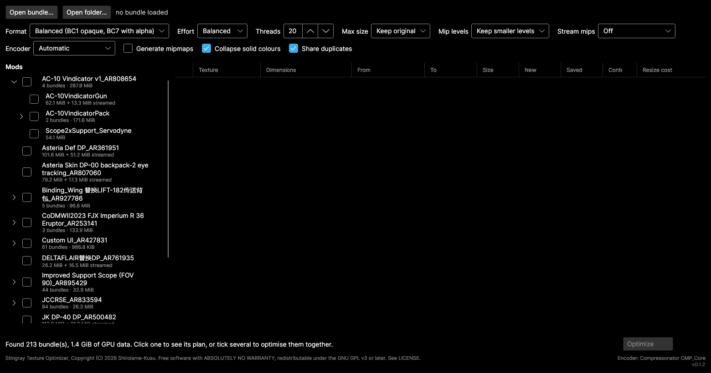
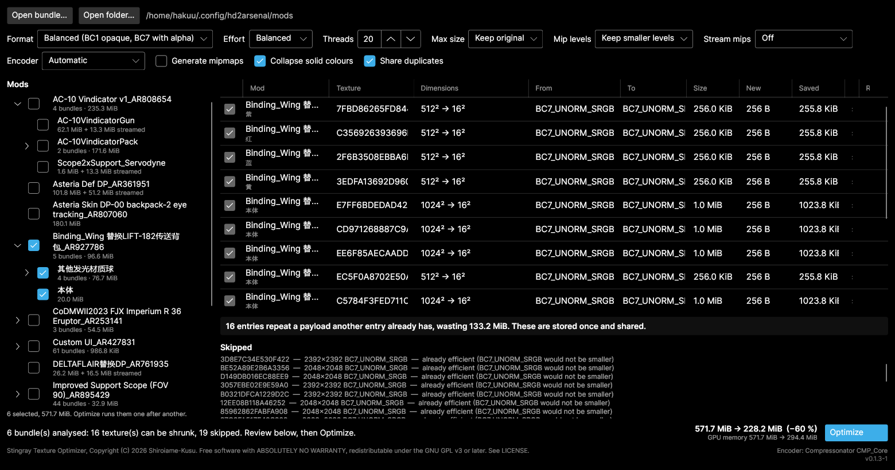
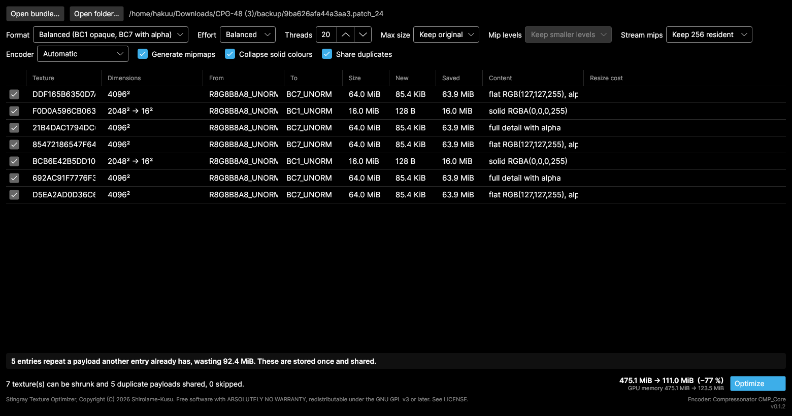

# Stingray Texture Optimizer

**English** | [简体中文](README.zh-CN.md)

> I made this app because some mods have `gpu_resources` files that are already
> 500+ MB, and loading them into the game can eat up roughly another 0.5 GB of
> VRAM.
>
> And there's a small problem with that:
>
> My RTX 4060 only has 8 GB of VRAM.
>
> As soon as I enter the game, my VRAM usage goes over the limit, and the game
> immediately starts stuttering.
>
> I designed the file format parsing and implemented the core functionality
> myself. AI is simply a powerful tool. The only thing I really used it for was
> building the GUI, and I personally reviewed every single line of code it
> generated before using it.
>
> I'm lazy, not stupid. 😎
>
> GLHF!

Shrinks Stingray/Bitsquid game bundles by block-compressing the textures inside
them.

**For anyone playing with mods**, whose card is running out of video memory
because the mods they installed carry hundreds of megabytes of textures. You do
not need to have made a mod to use this, or to ask permission: it works on a mod
you downloaded exactly as it works on one you wrote, and it keeps a backup so you
can put it back.

**For mod authors**, whose `.gpu_resources` has ballooned and who would rather
ship something smaller than ask every player to deal with it.

Works on bundles from Helldivers 2, Darktide and Vermintide 2 — the
`<hash>.patch_N` + `.gpu_resources` pair.

## Results

Two real mods. "GPU" is what the game has to hold in video memory, which is the
number that matters if you are running out of it — it is not the same as the file
size, see [File size is not video memory](#file-size-is-not-video-memory).

| Mod | Disk | GPU memory |
| --- | --- | --- |
| 475 MiB, uncompressed RGBA8 textures | 475 → **174.7 MiB** | 475 → **203.1 MiB** |
| 521 MiB, already all BC7 | 521.6 → **114.9 MiB** | 521.6 → **303.9 MiB** |
| …the same mod, allowing a 2048 cap | 521.6 → **54.9 MiB** | 521.6 → **111.9 MiB** |

The first two rows are **lossless**: block compression, collapsing surfaces that
turned out to be a single colour, and storing byte-identical payloads once. Only
the third row gives anything up, and it reports per texture exactly what.

Both bundles verified afterwards: every entry resolves to the content it did
before, and all non-texture data is byte-identical.

For the 8 GB card that prompted this: the second mod drops from **521.6 MiB of
VRAM to 303.9 MiB losslessly**, or **111.9 MiB** if you allow a 2048 cap. That
cap halves 16 textures, of which the tool measures 8 as losing nothing visible,
7 as softening slightly, and 1 as softening visibly — and it tells you which is
which, so you can keep that last one at full size.

### Why the numbers are what they are

- **A 4096×4096 texture exported without block compression is exactly 64 MiB.**
  Compressing it is 4–8×.
- **Whole surfaces are often empty.** One mod had three 4096×4096 BC7 textures
  holding a single colour, 16 MiB each, and 120 identical copies of one solid
  black 1024×1024.
- **Sharing duplicates shrinks the file but not video memory** — each entry is
  still its own GPU resource. If VRAM is what you are short of, the setting you
  want is `--max-size`.

## Quick start

Four steps, and you can accept every default on the way.

### 1. Download and unpack

Grab the archive for your system from [Releases](../../releases) and unzip it
anywhere. Nothing to install — no .NET runtime, no dependencies. Run
`stingray-tex-gui`.

### 2. Open the folder your mods are in

Press **Open folder…** and point it at wherever your mod manager keeps mods. It
searches everything underneath.



Each line says what that mod costs in GPU memory, which is the number this whole
tool is about. The list is the folder tree, because that is the only structure
the files actually carry: a mod shipping variants keeps them in folders under
itself, so those appear beneath the mod they belong to instead of as unexplained
names in a flat list. A mod with a single bundle is one line, not a folder to
open.

If you built the mod yourself and want one specific file, **Open bundle…** takes
it directly — the file with **no extension** or ending `.patch_0`, `.patch_1`
and so on. Not the `.gpu_resources`; that is found for you.

### 3. Tick what you want, then press Analyse

Ticking a mod ticks everything under it, and the button counts what is still
outstanding — **Analyse 6**, not just Analyse. Press it:



Everything ticked is read into one grid. The **Mod** column names the mod on top
and the variant underneath, because a name like *本体* means nothing on its own.
The totals at the bottom right cover the whole selection — here **571.7 MiB →
228.2 MiB**, a 60% cut across six bundles at once.

Nothing has been written yet. Analysing only reads.

### 4. Read the plan, then press Optimize

Each row is one texture. **Size → New** is what it costs now and after,
**Content** is what the analyser found inside it, and the tick on the left drops
any row you would rather leave alone.


That is a single bundle, which is what you get by clicking a mod instead of
ticking it — the same grid, one source. Two of its textures turned out to be a
single colour throughout, so they collapse from 2048² to 16×16: 16 MiB down to
128 bytes each, and they sample identically at any size. The banner above the
buttons reports payloads that appear more than once and will now be stored once.

Bottom right is the total, **475.1 MiB → 174.7 MiB**, and beneath it the GPU
memory separately — that is the one to watch if you are short of VRAM, since
sharing duplicates shrinks the file without changing what the card holds.

Press **Optimize**. Your originals are copied to a `backup/` folder beside the
bundle first, and the result is verified automatically afterwards.

### What should I choose?

**The defaults are safe — you can just press Optimize.** Everything on by
default is either exactly lossless or visually indistinguishable.

If you want to go further, the one setting worth touching is **Max size**. It
halves oversized textures, which is the only option here that actually throws
detail away. It is off by default.


Turn it to `2048 max` and the **Resize cost** column fills in with what halving
each texture actually costs, measured on its own pixels. Rows saying *nothing
visible lost* are free wins. Rows saying *visible softening* or *real detail
lost* are the ones to think about — untick the checkbox on the left to keep any
of them at full size.

Here that takes the mod from 521.6 MiB to 54.9 MiB, and its VRAM from 521.6 MiB
to 111.9 MiB, with exactly one texture flagged as visibly softening.

### Is this safe?

- Your originals are backed up before anything is written.
- The result is verified automatically; the tool tells you if anything is wrong.
- Non-texture data — models, bones, materials — is copied through untouched, byte
  for byte.

**Load the result in-game before you rely on it** — and before you share it, if
it is a mod you are publishing. Keep the `backup/` folder until you have.

If you are shrinking somebody else's mod for your own machine, nothing leaves
your disk: the tool rewrites the files in place, and the `backup/` folder puts
the original back if you want it. It changes nothing about how the mod is
installed or updated — though reinstalling or updating it will replace your
shrunk copy, so keep the command handy.

### If something looks wrong

Restore by copying everything from `backup/` back over the bundle. That is all
it takes; nothing else is modified.

## Why

Textures exported from an image editor land in a bundle as uncompressed RGBA8
with no mipmaps: 4 bytes per pixel, so one 4096×4096 texture is exactly 64 MiB.
Block compression cuts that 4–8×.

The bigger win is content-aware. Mods regularly ship textures whose channels are
entirely constant — an unused normal map slot filled with (127,127,255), or a
mask that is solid black. This tool detects those and collapses them.

A real example, a 475 MiB mod:

```
texture          dimensions         format           size ->        new  content
DDF165B6350D7A78 4096x4096          BC7_UNORM    64.0 MiB ->   16.0 MiB  flat RGB(127,127,255), alpha has 6 values
F0D0A596CB063EB5 2048x2048->16x16   BC1_UNORM    16.0 MiB ->      128 B  solid RGBA(0,0,0,255)
21B4DAC1794DC6CC 4096x4096          BC7_UNORM    64.0 MiB ->   16.0 MiB  full detail with alpha
85472186547F6415 4096x4096          BC7_UNORM    64.0 MiB ->   16.0 MiB  flat RGB(127,127,255), alpha has 5 values
BCB6E42B5DD10AB6 2048x2048->16x16   BC1_UNORM    16.0 MiB ->      128 B  solid RGBA(0,0,0,255)
692AC91F7776F3C2 4096x4096          BC7_UNORM    64.0 MiB ->   16.0 MiB  full detail with alpha
D5EA2AD0D36C69DC 4096x4096          BC7_UNORM    64.0 MiB ->   16.0 MiB  flat RGB(127,127,255), alpha has 5 values

total 475.1 MiB -> 203.1 MiB (saves 272.0 MiB)
```

Two of those seven textures held real artwork. Two were solid black at 2048².

### Already compressed? Still probably too big

Bundles whose textures are all properly BC7 can still be mostly waste, because
mods commonly ship the same payload under many ids. A second real example — 182
textures, every one already BC7, nothing to recompress:

```
duplicates: 164 entr(ies) repeat a payload another entry already has, wasting 357.4 MiB.
            These are stored once and shared.

total 521.6 MiB -> 164.3 MiB (saves 357.4 MiB)
```

120 of those entries were byte-identical copies of one 1024×1024 texture — and
that texture turned out to be solid black. Once the analyser decodes compressed
surfaces too, the same bundle goes to **114.9 MiB with nothing lost at all**:
sharing duplicates and collapsing solid-colour surfaces are both exact.

Allowing a resize on top (`--max-size 2048`) takes it to **54.9 MiB**.

## Install

### Prebuilt binaries

Grab an archive from [Releases](../../releases). Nothing else to install — not
even a .NET runtime.

| Platform | Archive |
| --- | --- |
| Linux x64 | `stingray-tex-<version>-linux-x64.tar.gz` |
| Windows x64 | `stingray-tex-<version>-win-x64.zip` |
| macOS Intel | `stingray-tex-<version>-osx-x64.tar.gz` |
| macOS Apple Silicon | `stingray-tex-<version>-osx-arm64.tar.gz` |

Unpack it and run. Keep the files together — the executables load the libraries
beside them.

```
stingray-tex           CLI, ~2.7 MB
stingray-tex-gui       GUI, ~22 MB
libSkiaSharp.so        rendering
libHarfBuzzSharp.so    text shaping
stingray_cmp.so        fast encoder (Linux and Windows)
```

Both are compiled with **Native AOT**, so neither needs a .NET runtime; on Linux
the binaries link nothing beyond `libc` and `libm`. The CLI starts in about a
millisecond.

Skia and HarfBuzz stay as separate shared libraries because SkiaSharp ships no
static archive to link against. Everything else is inside the executables.

#### Checking what you downloaded

Every archive carries GitHub build provenance, signed during the release run and
tied to the commit that produced it:

```
gh attestation verify stingray-tex-<version>-<platform>.zip \
  --repo Shiroiame-Kusu/StingrayTextureOptimizer
```

SHA-256 sums for each archive are in the release notes.

<details>
<summary>If your antivirus objects</summary>

The binaries are unsigned — a code signing certificate costs several hundred a
year, which is more than this tool has ever cost to make. An unsigned,
statically linked executable with no download history is exactly the shape
generic heuristics are built to distrust, so an occasional single-vendor
"suspicious/generic" verdict is expected. A hit from one engine out of seventy
is what a false positive looks like; a hit from Microsoft, Kaspersky, ESET or
BitDefender would be worth taking seriously, and I would want to hear about it.

What the Windows binaries actually import, which is checkable with `objdump -p`
or Dependency Walker on the files themselves:

- `KERNEL32`, `ADVAPI32`, `ole32`, `OLEAUT32`, `bcrypt`, and the C runtime.
- **No networking of any kind** — no `WS2_32`, `WININET`, `WINHTTP`, `urlmon` or
  `DNSAPI`. The tool cannot open a connection.
- No `CreateProcess`, `ShellExecute`, `WriteProcessMemory`, `CreateRemoteThread`
  or `SetWindowsHookEx`; nothing that starts or touches another process.
- No `RegSetValue`/`RegCreateKey`, so nothing that could persist.
- The cryptography is SHA-256 (`BCrypt*`), used to find byte-identical texture
  payloads so they can be stored once. `IsDebuggerPresent` comes from the C
  runtime and appears in essentially every native binary.

File entropy is about 6.5, well below the ~7.2 that indicates packing, and the
sections are the ordinary `.text/.rdata/.data/.pdata/.rsrc/.reloc`.

**What changed in 0.1.3, since 0.1.0 through 0.1.2 drew no complaints.** Only
one thing about the Windows payload is materially different, and it is
`stingray_cmp.dll`. Until 0.1.3 a missing export marker meant it exported
nothing, so the linker stripped it to 60 KB of padding — entropy 1.8, a hollow
file. Fixing that made it what it was always supposed to be: 208 KB of vector
code, entropy 5.4, `.text` 28 times larger. So every scanner is meeting this
library for the first time, unsigned and — until now — with no version resource
naming it. It carries one from 0.1.4 on.

**If you would rather not have it at all, delete it.** The fast encoder is
optional: with `stingray_cmp.dll` gone the tool falls back to the managed
encoder and everything still works, several times slower. `stingray-tex
--version` reports which one it found. Nothing else in the archive depends on
it.

**Reporting it helps more than working around it.** MaxSecure and the other
engines all take false-positive submissions, and a single-vendor verdict on an
open-source tool usually clears within days once someone tells them.

</details>

<details>
<summary>How the GUI is AOT-safe despite Avalonia's <code>DataGrid</code></summary>

Every binding in the XAML is a compiled binding, including the ones inside
`DataGrid` cell templates, which carry an inline `x:DataType`. Reflection
bindings do not survive trimming, and the compiler reports each one, so this is
checked at build time rather than assumed.

That leaves `Avalonia.Controls.DataGrid` itself, which is not annotated for
trimming and rolls its warnings up into `IL2104`/`IL3053`. Those are suppressed
in `Stingray.Gui.csproj`, which records what each underlying warning covers —
briefly: column auto-generation is never used, the row properties the grid
resolves reflectively are pinned by `TrimmerRoots.xml`, and no column needs a
converting binding.

Since a clean link says nothing about run-time reflection, CI renders the window
offscreen from the published binary and fails if no image comes back.

</details>

### From source

Requires the [.NET 10 SDK](https://dotnet.microsoft.com/download).

```sh
git clone https://github.com/Shiroiame-Kusu/StingrayTextureOptimizer.git
cd StingrayTextureOptimizer

# optional but recommended: builds the fast encoder (needs cmake and a C++ compiler).
# Run once; dotnet build then copies it into the app output automatically.
./native/build.sh          # native\build.ps1 on Windows

dotnet build -c Release

# optional: Native AOT builds, as shipped (needs clang and zlib on Linux)
dotnet publish src/Stingray.Cli -c Release -r linux-x64 -o out/cli
dotnet publish src/Stingray.Gui -c Release -r linux-x64 -o out/gui
```

Without the first step the tool still works, just on the slower managed
encoder — the footer of the GUI and the `analyze` output both say which one is
in use.

## Language

The GUI is in **English and Simplified Chinese**, and picks one by reading the
system's language at startup — `LC_ALL`, `LC_MESSAGES`, `LANG` or `LANGUAGE` on
Linux and macOS, and the user's UI language on Windows. Anything Chinese gets
Chinese; everything else gets English.

To override it, set `STINGRAY_LANG`:

```sh
STINGRAY_LANG=zh stingray-tex-gui     # force Chinese
STINGRAY_LANG=en stingray-tex-gui     # force English
```

Traditional Chinese locales (`zh_TW`, `zh_HK`) also get the Simplified
translation, on the grounds that it reads closer than English does.

The command line stays English whatever the system says: its output is
documented, diffed and scripted against, and a locale-dependent `analyze` would
break that.

No CJK font ships with the app — it uses whatever the system provides, which on
Windows, macOS and any desktop Linux install is already there.

## Use

### GUI

```sh
dotnet run --project src/Stingray.Gui -c Release
```

Open a bundle, review the plan, override any per-texture format you disagree
with, then Optimize. Originals are copied to a `backup/` folder next to the
bundle before anything is written, and the result is verified automatically.

#### Working on several mods at once

**Backup folders are skipped when scanning**, including the ones this tool
writes. Without that, every mod you had already optimised would be listed twice
— once as it is and once as it was — and optimising the wrong one would destroy
the only way back.

**Analysis is kept for as long as it is valid.** Untick a mod and its rows leave
the grid; tick it back and they return exactly as they were, including any
individual textures you had unticked. Tick something new and only the newcomer
is analysed. On a real folder, four bundles take 2.9 s and adding a fifth then
costs 156 ms rather than another 2.9 s. Clicking a mod to look at it counts too,
so ticking it afterwards is free.

**Changing a setting is the one thing that retires it**, since a plan describes
the settings it was built under. The button goes back to offering an analysis
rather than a write.

**The screen always shows what the button would do.** Opening one bundle takes a
batch off the grid rather than leaving its totals summed against that bundle's.
The half-ticked mark is something a mod is told it is by its variants, never
something a click can ask for.

Writing then backs up and verifies each bundle in turn. Anything that turns out
not to shrink is counted and left alone rather than rewritten for nothing.

### CLI

```sh
# See what would happen
stingray-tex analyze mymod.patch_0

# Rewrite in place (backs up to ./backup first, then verifies)
stingray-tex optimize mymod.patch_0

# Write elsewhere instead of editing in place
stingray-tex optimize mymod.patch_0 --output ./out

# Check a bundle, optionally against its pre-optimisation original
stingray-tex verify mymod.patch_0 --original backup/mymod.patch_0
```

## Options

The same settings appear in the GUI toolbar and on the command line.

### Format — `--strategy` (GUI: *Format*)

Which block format each texture is encoded to. Affects both size and quality.

| Value | GUI label | Opaque | Cutout alpha | Graded alpha |
| --- | --- | --- | --- | --- |
| `balanced` *(default)* | Balanced (BC1 opaque, BC7 with alpha) | BC1 | BC7 | BC7 |
| `quality` | Best quality (BC7 always) | BC7 | BC7 | BC7 |
| `smallest` | Smallest size (BC1 wherever it fits) | BC1 | **BC1** | BC7 |

BC1 is half the size of BC7 but has 5:6:5 colour endpoints, so it bands on
gradients. BC7 reproduces any 8-bit RGBA almost exactly.

"Cutout alpha" means alpha is only ever 0 or 255 — a stencil mask with no
partial transparency. BC1 stores exactly one bit of alpha, so those fit it at
half the size of BC7. Anything with graded alpha needs BC7 under every
strategy.

### Effort — `--quality` (GUI: *Effort*)

`fast` | `balanced` *(default)* | `best`. How many encodings the compressor tries
before settling. **It never changes the output size** — block formats are fixed
rate — only how close the result is to the source, and how long it takes.

Measured on a real 4096×4096 artwork texture, 12 threads:

| Format | Effort | Time | PSNR (RGB) |
| --- | --- | --- | --- |
| BC7 | Fast | 16.7 s | 50.62 dB |
| BC7 | Balanced | 22.9 s | 50.90 dB |
| BC7 | Best | 54.4 s | 51.24 dB |
| BC1 | Fast | 0.3 s | 37.98 dB |
| BC1 | Balanced | 1.1 s | 41.23 dB |
| BC1 | Best | 0.9 s | 41.29 dB |

The two formats behave completely differently:

- **BC7 barely responds.** The whole range spans 0.6 dB while taking 3.3× longer.
  `Best` is not worth it; even `Fast` is visually indistinguishable.
- **BC1 responds a lot at the bottom.** `Fast` costs 3.3 dB against `Balanced`,
  which is a real, visible difference — and `Best` adds nothing beyond it.

So `balanced` is the right default in both cases. Reach for `fast` only when
you are iterating and everything is BC7; avoid it when BC1 is in play. `best`
buys almost nothing for a large amount of time.

**Effort is relative to the encoder you picked, not an absolute quality
target.** The same word means different things:

| | Fast | Balanced | Best |
| --- | --- | --- | --- |
| Compressonator | 51.6 dB | **54.6 dB** | 55.4 dB |
| BCnEncoder | 50.9 dB | 51.3 dB | 51.6 dB |

Compressonator at `balanced` beats BCnEncoder at `best` by 3 dB. Switching
encoder changes your output even if you leave Effort alone.

### Threads — `--threads`

Encoder worker threads. Defaults to **CPU count − 4**, deliberately leaving cores
free: saturating every core with a BC7 encode makes a desktop session unusable.

### Max size — `--max-size N` (GUI: *Max size*)

Halve any texture larger than N until it fits. **Off by default — this is the
only genuinely lossy option.** Every affected texture reports its measured detail
cost, so you can untick the ones that matter. See
[Resizing](#resizing-and-whether-it-will-look-blurry).

**Textures that carry a mip chain are shrunk by discarding levels rather than by
re-encoding.** Every level that survives is the author's own data, already
compressed, so nothing is resampled and no generation loss is added — it is a
byte slice, and it takes well under a second for a whole bundle. The DDS header
is rewritten to describe what is left.

That matters more than it sounds. A well-made mod may already be entirely BC7,
with nothing to recompress and no duplicate payloads, and still cost a great deal
of video memory because its textures carry full chains that are all resident.

### Mip levels — `--mips keep|single` (GUI: *Mip levels*)

| Value | GUI label | What it keeps |
| --- | --- | --- |
| `keep` *(default)* | Keep smaller levels | Discards only the levels above the cap. The texture stays mipmapped. |
| `single` | Keep one level only | Keeps the largest level that fits and throws the rest away. |

Measured on a real 205.6 MiB mod that was already fully BC7 — before this it
saved nothing at all:

| Cap | `keep` | `single` |
| --- | --- | --- |
| none | 205.6 MiB | 178.6 MiB |
| 2048 | 165.6 MiB | 148.6 MiB |
| 1024 | **117.6 MiB** | **112.6 MiB** |
| 512 | 103.6 MiB | 102.1 MiB |

`single` is only about 4% smaller, because the levels below the top one add up to
roughly a third of it. For that it gives up mipmapping altogether, which brings
back shimmering on minified surfaces and costs texture-cache efficiency. **Prefer
`keep`**; reach for `single` only when you are genuinely out of memory and the
texture is something like a UI element that is never minified.

Streamed textures are skipped under both: their top levels live in the `.stream`
file, so slicing `gpu_resources` alone would desynchronise the two.

### Generate mipmaps — `--add-mips` (GUI: *Generate mipmaps*) — off by default

Plenty of mods ship textures with **no mip chain at all** — an image exported
straight from an editor has one level and nothing else. Those textures shimmer
and crawl whenever they are seen at an angle or from a distance, because the GPU
has no smaller level to sample from. This builds the chain they should have had.

It is also what makes `--stream` possible for them: streaming can only move
levels that exist, so a single-level texture has nothing to stream. That is why
the GUI ticks this for you when you pick a *Stream mips* level, and unticks it
again if you set that back to *Off* — on its own it is a cost, not a saving.

Unticking it goes the other way too, but only where it has to: if nothing in the
open bundle carries a chain of its own, *Stream mips* returns to *Off*, because
there would be nothing left for a floor to reach. Where some textures do have
one, the floor stays — those stream exactly as they are, so "stream what already
has a chain and re-encode nothing" remains something you can ask for.

On its own it **costs** about a third more video memory, since the chain below
level 0 adds up to that. The two together are the point:

| | video memory |
| --- | --- |
| untouched (7 textures, 4096² RGBA8, no mips) | 475.1 MiB |
| compressed to BC7 | 203.1 MiB |
| `--add-mips` | 229.7 MiB |
| `--add-mips --stream 256` | **123.5 MiB** |



That is the same bundle as the first screenshot, with one dropdown changed.
Picking *Keep 256 resident* ticked *Generate mipmaps* by itself — a texture with
no chain has nothing to stream — and greyed out *Mip levels*, because a streamed
texture keeps whatever chain it has. Each 64 MiB texture goes to **85.4 KiB**
resident, with the full 4096² chain a stream away, and GPU memory falls from
475.1 MiB to 123.5 MiB. The remainder is mesh data, which this tool does not
touch.

Compare the **New** column with the first screenshot: plain compression took
those textures to 16 MiB each, and this takes them to 85 KiB — not by throwing
anything away, but by moving it somewhere the engine can fetch it from when it
is actually needed.

This one re-encodes, so it is not lossless — but level 0 is byte-for-byte the
same encode the texture would have got without a chain, so nothing changes in
what you see up close. Levels below it are new, generated by successive box
filtering.

Levels smaller than 4×4 are always encoded by the portable backend: CMP_Core
works on whole 4×4 blocks and refuses anything smaller, while a chain still has
to run down to 1×1.

### Stream mips — `--stream N` (GUI: *Stream mips*) — experimental, off by default

Every other option here buys video memory with quality. This one buys it with
**disk space instead, and costs no quality at all.**

Stingray can already keep a texture's chain in the `.stream` file and hold only
a small tail permanently in video memory, loading the sharp levels on demand
when the texture is actually on screen. Mod tooling routinely writes "not
streamed" into every texture it touches, which throws that away — so a 4096²
BC7 texture sits in VRAM at its full 21.3 MiB whether or not you are looking at
it. `--stream 256` moves the whole chain into `.stream` and keeps only 256² and
below resident.

On the Asteria mod, at `--stream 256`:

| | before | after |
| --- | --- | --- |
| video memory | 205.6 MiB | **99.4 MiB** |
| `.stream` on disk | 1.5 MiB | 95.9 MiB |

19 textures converted. Nothing is discarded and nothing is re-encoded — every
byte written is a copy of a byte that was already there, which the tests check
against the original. The textures that do not convert are the single-mip ones,
which have no chain to move.

**On a mod with no mip chains at all, this option alone does nothing** — and
plenty of mods are exactly that. Build the chains first and they become
streamable; the GUI ticks *Generate mipmaps* for you when you pick a level, and
the CLI says so:

```
$ stingray-tex analyze mymod.patch_0 --stream 512
note: 7 texture(s) here carry no mip chain, so --stream cannot move them.
Pass --add-mips to build chains first, and they become streamable too.

$ stingray-tex analyze mymod.patch_0 --stream 512 --add-mips
gpu    143.1 MiB ->  124.7 MiB   (saves 18.3 MiB)
```

**It composes with `--max-size`,** which is usually what you want. The cap
discards levels above it for good — the only part that costs quality — and what
survives goes to `.stream`. So `--max-size 1024 --stream 256` means `.stream`
holds 1024 and down while video memory holds 256 and down:

| | added to `.stream` | video memory |
| --- | --- | --- |
| `--stream 256` | 107.7 MiB | 99.4 MiB |
| `--max-size 1024 --stream 256` | **19.7 MiB** | 99.4 MiB |

Same video memory for a fifth of the disk. A floor at or above the cap can never
stream anything, so the GUI stops offering those and the CLI treats them as a
no-op.

**Mip levels does not apply while this is on.** Streaming keeps whatever chain
survives the cap — that is the point — so there is nothing further to drop, and
the GUI disables that dropdown rather than letting it look as though it applied.

#### What N actually is, and what to set it to

N is **the largest mip level that stays in video memory permanently**. At
`--stream 256`, levels 256² and below live in `.gpu_resources` for good, and
everything larger lives only in `.stream`, loaded when the texture is on screen.

So the resident copy is the guaranteed baseline — what can be drawn immediately,
before anything is streamed in. A lower N means less permanent memory but a
blurrier first look at something that has just appeared.

That sounds like a real trade-off. It mostly is not:

| Floor | video memory | saved |
| --- | --- | --- |
| off | 205.6 MiB | — |
| 2048 | 165.6 MiB | 40.0 MiB |
| 1024 | 117.6 MiB | 88.0 MiB |
| **512** | 103.6 MiB | **102.0 MiB** |
| 256 | 99.4 MiB | 106.2 MiB |
| 128 | 98.0 MiB | 107.6 MiB |
| 64 | 97.7 MiB | 107.9 MiB |

Dropping from 512 all the way to 64 buys **5.9 MiB more**, after 102 MiB has
already been saved — the same geometric series as everywhere else on this page.
By 512 there is almost nothing left to give.

**Turning it on is what matters; the value barely does.** Use **512**: within
6 MiB of the best case, with a usable image always resident so pop-in is least
visible. Lower values chase the last few per cent at the cost of a blurrier
first frame.

**Why it is off by default.** The conversion has to write one field in the
Stingray prefix whose meaning is not established: every streamed texture carries
1 or 2 there, and **nothing in the texture decides which.** Reading 1,259 texture
headers out of the shipped game data settles that it is not a matter of too few
samples — textures identical in every header field, down to the whole mip table,
carry both values, so whatever selects it is not in the texture.

This tool writes 2 when the id at the start of the prefix is zero and 1
otherwise, which matches the shipped data 75% of the time against a ceiling of
77% for any rule based on that id. It is still a guess.

**Getting it wrong looks harmless.** The flag was inverted on all 53 streamed
textures across two mods, both directions covered, and the difference in game
was reported as almost none — nothing failed to load, nothing rendered wrong.
That is one test rather than a guarantee, and a subtle streaming-priority effect
would be hard to see, but it is not the kind of field that breaks a texture. The
option stays off by default because it is still doing something the engine was
not asked about; keep the backup and test your own mods.

### Collapse solid colours — `--no-collapse` disables (GUI: *Collapse solid colours*)

A texture whose every pixel is identical is rewritten at 16×16. Visually
lossless, because a constant texture samples the same at any resolution. Saves
**both** file size and video memory. Only disable it if a shader reads the
texture with `textureSize()` or absolute `texelFetch` coordinates.

### Share duplicates — `--no-dedup` disables (GUI: *Share duplicates*)

Byte-identical payloads are stored once and referenced by every entry that uses
them. Lossless, and usually the largest saving in an already-compressed bundle.
**Shrinks the file only** — see [File size is not video
memory](#file-size-is-not-video-memory).

### Encoder — `--encoder` (GUI: *Encoder*)

Which compressor does the work. `auto` *(default)* | `compressonator` | `managed`.

| Value | GUI label | What it is |
| --- | --- | --- |
| `auto` *(default)* | Automatic | Fast when available, portable otherwise |
| `compressonator` | Fast (Compressonator) | Bundled ~500 KB native library built from AMD's CMP_Core |
| `managed` | Portable (BCnEncoder) | Pure managed, always available |

The fast encoder is both quicker *and* slightly better. Measured on a 4096×4096
texture at 12 threads:

| Encoder | Effort | Time | PSNR |
| --- | --- | --- | --- |
| Compressonator | Fast | **1.6 s** | 51.6 dB |
| Compressonator | Balanced | 8.6 s | **54.6 dB** |
| BCnEncoder | Fast | 18.8 s | 50.9 dB |
| BCnEncoder | Best | 55.2 s | 51.6 dB |

Compressonator at *Fast* matches BCnEncoder at *Best*, 34× quicker.

The native library ships for **Linux and Windows**. macOS releases contain the
managed encoder only, and `auto` falls back to it silently — as it does anywhere
the library is missing. `--encoder compressonator` fails loudly instead, so you
find out rather than quietly getting the slow path. See
[`native/README.md`](native/README.md) to build it yourself.

### `--dry-run`

Analyse and report without writing anything.

### `--version`

Prints the version and exits. Release builds carry their git tag; untagged CI
builds report `0.0.0-<sha>`, so any binary can be traced back to a commit. The
GUI shows the same string in its title bar and bottom-right corner.

## Deduplication

Every GPU payload is hashed. Where several entries have byte-identical content,
the payload is written once and each entry points at it — the format stores an
explicit `(offset, size)` per entry, so nothing requires them to be disjoint.

This is lossless and usually the single largest saving in an already-compressed
bundle. Disable with `--no-dedup` if you want a strictly one-payload-per-entry
layout.

## File size is not video memory

The tool reports two numbers, because they are not the same thing:

```
disk   521.6 MiB ->   54.9 MiB   (saves 466.7 MiB)
gpu    521.6 MiB ->  111.9 MiB   (saves 409.7 MiB)
```

Sharing a duplicate payload shrinks the **file**, but the engine still builds one
GPU resource per entry, so both entries are uploaded and video memory is
unchanged. Only actually shrinking a surface helps there:

| Optimisation | Smaller file | Less video memory |
| --- | --- | --- |
| Block compression | yes | yes |
| Collapsing a solid colour | yes | yes |
| Resizing | yes | yes |
| Sharing duplicates | yes | **no** |

So if you are chasing download size, deduplication is the big win. If you are
chasing VRAM, it does nothing and you want `--max-size` or `--stream`.

Two caveats on the GPU figure: it assumes every texture is resident at once,
which is the worst case, and it excludes anything the engine pulls in from the
`.stream` file on demand.

## Mip levels and video memory

Mipmaps exist for filtering, not loading. The GPU picks a level per *pixel* as
it samples, which is what trilinear and anisotropic filtering are — so the whole
chain has to be in memory at once, because the hardware needs any level at any
moment. That is why a mip chain costs VRAM rather than saving it.

**Each level is a quarter of the one above.** The chain is therefore a geometric
series that converges: everything below the top level adds up to only a third of
it, and the whole chain costs **4/3 of level 0**.

Two things follow, and they surprise people in opposite directions.

**Throwing the chain away barely helps.** All the smaller levels together are a
third of the top one, so dropping them saves 25% and costs you every benefit
mipmaps provide. That is why `--mips single` is a bad trade almost always.

**Halving the top level quarters everything.** Drop one level from the front and
the whole remaining chain is a quarter of what it was, because the new top level
is a quarter and the ratio below it is unchanged.

For one 4096² BC7 texture with a full 13-level chain:

| Resident in VRAM | How | VRAM | of original |
| --- | --- | --- | --- |
| whole chain, 4096 down | untouched | 21.33 MiB | 100% |
| 4096 alone, no chain | `--mips single` | 16.00 MiB | 75% |
| chain from 2048 down | `--max-size 2048` | 5.33 MiB | 25% |
| chain from 1024 down | `--max-size 1024` | 1.33 MiB | 6.3% |
| chain from 512 down | `--max-size 512` | 341.4 KiB | 1.6% |
| chain from 256 down | `--max-size 256` | 85.4 KiB | 0.4% |

Read the last four rows as one rule: **every halving costs a quarter as much.**
Going from a 2048 cap to 1024 saves nearly as much again, in relative terms, as
the first halving did.

### Where streaming changes the arithmetic

`--stream N` keeps exactly the same levels resident as `--max-size N` — the tail
from N downwards — so it lands on exactly the same row of that table:

| | VRAM | Largest level you can still see |
| --- | --- | --- |
| `--max-size 256` | 85.4 KiB | 256² — the rest is gone for good |
| `--stream 256` | 85.4 KiB | **4096²**, loaded on demand |

Identical video memory, and one of them keeps the texture. The difference is
paid on disk (the full chain moves to `.stream` rather than being discarded) and
in latency: the sharp levels arrive shortly after the texture comes into view,
so a close-up can be briefly soft. `--max-size` never has that pop-in because
there is nothing left to load.

### What the engine actually does with a streamed texture

Helldivers 2 ships its streaming settings in `data/settings.ini`, so this is not
guesswork:

- Levels are picked by **texel density** — how large the texture is on screen,
  not how far away it is.
- It starts low and climbs (`initialize_at_max = false`), limited to 16 MiB and
  32 texture updates per frame. That rate limit is the pop-in.
- Streamed memory is **budgeted and evicted**: a 1536 MB pool, textures unseen
  for a while become candidates, levels are dropped and then unloaded, and the
  engine shrinks harder as it nears the budget.

Which means the two files are not merely different places to put bytes:

| | Allocation |
| --- | --- |
| `.gpu_resources` | **always allocated**, unbounded, against a 5376 MB texture heap |
| `.stream` | **capped at 1536 MB**, the engine evicts to stay under it |

So streaming moves memory out of a permanent unbounded allocation into a pool
whose peak the engine enforces. That is the real reason it helps: not just a
smaller number, but a bounded one.

It also fixes what the tool's `gpu` figure means. **It is the always-allocated
part** — what is permanently spent before anything is streamed. Streamed content
adds at most the pool budget on top, and the engine manages that itself.

That is the whole reason `--stream` exists. Every other option here buys video
memory with quality; this one buys it with disk space.

On a real 205.6 MiB mod, 23 of whose textures carried full chains that were
entirely resident:

| | video memory | `.stream` on disk |
| --- | --- | --- |
| untouched | 205.6 MiB | 1.5 MiB |
| `--max-size 1024` | 117.6 MiB | 1.5 MiB |
| `--stream 256` | 99.4 MiB | 91.5 MiB |
| `--max-size 1024 --stream 256` | 99.4 MiB | 15.5 MiB |

The last row is usually the one you want. The cap decides how much detail is
worth *storing*; the floor decides how much is worth keeping *resident*. Same
video memory as streaming alone, for a sixth of the disk.

(The rest of the 99.4 MiB is textures with no mip chain at all, which have
nothing to stream. Streaming can only move levels that already exist — which is
what `--add-mips` is for.)

### Textures that never had a chain

A single-level texture cannot be streamed, and it shimmers when minified. Both
are fixed by building the chain it should have had, which is what `--add-mips`
does. Adding one costs a third more video memory on its own; combined with a
floor it hands nearly all of that back:

| | video memory per 4096² texture |
| --- | --- |
| no chain (as shipped) | 16.00 MiB |
| chain added | 21.33 MiB |
| chain added, `--stream 256` | **85.4 KiB** |

Across one real mod's 81 chainless textures that is 639.4 MiB down to 8.1 MiB,
and they stop crawling at distance as well.

## Resizing, and whether it will look blurry

Resizing is the only genuinely lossy thing the tool does, so it is **off by
default** and every affected texture is measured rather than guessed at.

For each texture the analyser halves the surface, restores it, and reports the
PSNR. That number says how much detail genuinely needs full resolution:

| Measured | Meaning |
| --- | --- |
| ∞ | Solid colour — resizing changes nothing |
| ≥ 45 dB | `nothing visible lost` — halving is effectively free |
| 36–45 dB | `slight softening` |
| 30–36 dB | `visible softening` |
| < 30 dB | `real detail lost` |

**This figure does not change with the encoder, and does not need to.** It is
measured on the texture's own pixels, before compression. Block compression
contributes far less error than halving does, so the resize term dominates the
total — checked against the full resize-and-re-encode pipeline on real textures:

| Texture | Reported | Resize + encode | Encode alone |
| --- | --- | --- | --- |
| detailed normal map | 30.0 dB | 29.9 dB | 53.9 dB |
| artwork | 37.4 dB | 36.2 dB | 57.4 dB |
| smooth | 50.4 dB | 49.8 dB | 78.3 dB |

So the number you see is within about 1 dB of what you actually get.

From one real bundle's eight distinct 4096² textures: three were a single colour,
three scored 47–93 dB, one scored 38 dB, and only one scored 30 dB — a normal map
whose fine ribbing did visibly soften. So "should I halve my 4K textures?" has a
different answer per texture, which is why the plan shows the number and lets you
tick each one individually.

Already-compressed textures are only ever resized, never re-encoded into a
different format: that would compound generation loss for no size gain. sRGB
formats stay sRGB, since writing a linear format where the engine expects sRGB
shifts every colour on screen.

## How it decides

| Content | Target | Lossless |
| --- | --- | --- |
| Every pixel identical | BC1 (or BC7 if the colour is not exact in 5:6:5), collapsed to 16×16 | yes |
| Alpha uniformly opaque | BC1 — or BC7 under `--strategy quality` | no |
| Alpha carries detail | BC7 | no |

A constant texture samples identically at any resolution, so collapsing it is
visually lossless. BC1 endpoints are 5:6:5, so a colour like (127,127,255) does
*not* survive it; the analyser checks and falls back to BC7, which reproduces any
8-bit RGBA exactly.

Already-compressed textures are decoded and analysed too — that is how a
4096×4096 BC7 surface holding one colour gets found. Textures with a legacy
FourCC header, mipmaps, BC6H content, or dimensions that are not a multiple of 4
are reported and skipped.

## Safety

Rewriting a bundle only touches two things: DDS header fields, and each entry's
GPU offset and size. CPU payload lengths never change, so every offset in the
file table stays valid, and non-texture assets are copied through byte for byte.

Every write is followed by an independent verification pass that re-reads the
result and checks alignment, overlap, bounds, header/table agreement, and — when
given the original — that all passthrough payloads are unchanged.

One caveat specific to deduplication: sharing a payload between entries is
consistent with the format, but no vanilla bundle examined actually does it, so
it is not a pattern the engine has been *observed* to rely on. It verifies
clean and every entry resolves to identical bytes — but this is the part most
worth confirming in-game, whether you are about to publish the mod or just to
play it. `--no-dedup` avoids it entirely.

That said: **this rewrites game files.** Keep the backups until you have loaded
the result in-game.

## Layout

```
src/Stingray.Core   format parsing, analysis, encoding, verification
src/Stingray.Cli    stingray-tex
src/Stingray.Gui    Avalonia desktop app
tests/              xUnit, builds synthetic bundles from scratch
docs/               reverse-engineered format notes
```

Tests never depend on real game bundles — those are copyrighted and cannot be
committed — so `SyntheticBundle` constructs valid ones in memory.

## Format

See [`docs/bundle-format.md`](docs/bundle-format.md) for the container layout,
including which fields remain unidentified.

## Changes

See [CHANGELOG.md](CHANGELOG.md).

## Contributing

See [CONTRIBUTING.md](CONTRIBUTING.md). Additions to the type-id table are
especially welcome, provided you can say how you confirmed them.

## Licence

GPL-3.0-or-later. See [LICENSE](LICENSE).

> This program is free software: you can redistribute it and/or modify it under
> the terms of the GNU General Public License as published by the Free Software
> Foundation, either version 3 of the License, or (at your option) any later
> version.
>
> This program is distributed in the hope that it will be useful, but WITHOUT ANY
> WARRANTY; without even the implied warranty of MERCHANTABILITY or FITNESS FOR A
> PARTICULAR PURPOSE. See the GNU General Public License for more details.

Dependencies are all permissively licensed and so may be combined with GPL code:
[BCnEncoder.Net](https://github.com/Nominom/BCnEncoder.NET) (MIT OR Unlicense),
[Avalonia](https://avaloniaui.net/) (MIT),
[CommunityToolkit.Mvvm](https://github.com/CommunityToolkit/dotnet) (MIT) and
[Tmds.DBus.Protocol](https://github.com/tmds/Tmds.DBus) (MIT). Their own terms
continue to apply to them.

Not affiliated with Autodesk, Arrowhead, Fatshark, or any game publisher.
