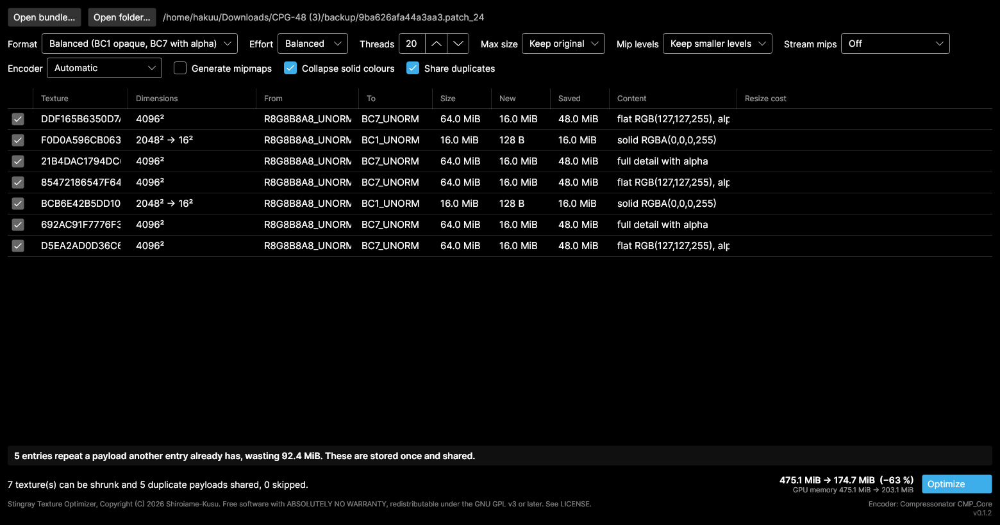
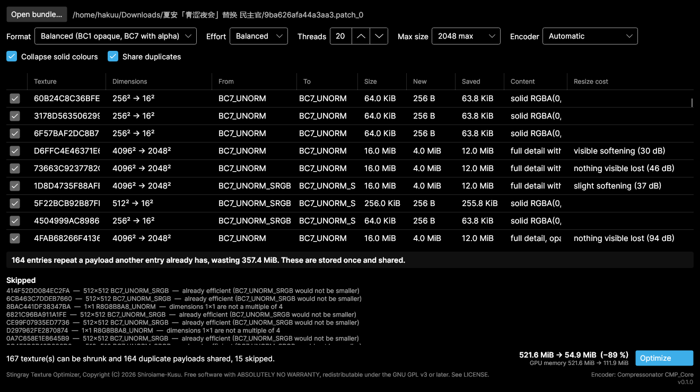

# Stingray Texture Optimizer

> I made this app because some mods have `gpu_resources` files that are already
> 500+ MB, and loading them into the game can eat up roughly another 0.5 GB of
> VRAM.
>
> And there's a small problem with that:
>
> My RTX 4060 only has 8 GB of VRAM.
>
> As soon as I enter the game, my VRAM usage goes over the limit, and the game
> immediately starts stuttering.
>
> So I used AI to help me build this app. That said, all the testing and code
> review are still done manually by me.
>
> I'm lazy, not stupid. 😎
>
> GLHF!

Shrinks Stingray/Bitsquid game bundles by block-compressing the textures inside
them. Built for mod authors whose `.gpu_resources` file has ballooned to hundreds
of megabytes.

Works on bundles from Helldivers 2, Darktide and Vermintide 2 — the
`<hash>.patch_N` + `.gpu_resources` pair.

## Results

Two real mods. "GPU" is what the game has to hold in video memory, which is the
number that matters if you are running out of it — it is not the same as the file
size, see [File size is not video memory](#file-size-is-not-video-memory).

| Mod | Disk | GPU memory |
| --- | --- | --- |
| 475 MiB, uncompressed RGBA8 textures | 475 → **174.7 MiB** | 475 → **203.1 MiB** |
| 521 MiB, already all BC7 | 521.6 → **114.9 MiB** | 521.6 → **303.9 MiB** |
| …the same mod, allowing a 2048 cap | 521.6 → **54.9 MiB** | 521.6 → **111.9 MiB** |

The first two rows are **lossless**: block compression, collapsing surfaces that
turned out to be a single colour, and storing byte-identical payloads once. Only
the third row gives anything up, and it reports per texture exactly what.

Both bundles verified afterwards: every entry resolves to the content it did
before, and all non-texture data is byte-identical.

For the 8 GB card that prompted this: the second mod drops from **521.6 MiB of
VRAM to 303.9 MiB losslessly**, or **111.9 MiB** if you allow a 2048 cap. That
cap halves 16 textures, of which the tool measures 8 as losing nothing visible,
7 as softening slightly, and 1 as softening visibly — and it tells you which is
which, so you can keep that last one at full size.

### Why the numbers are what they are

- **A 4096×4096 texture exported without block compression is exactly 64 MiB.**
  Compressing it is 4–8×.
- **Whole surfaces are often empty.** One mod had three 4096×4096 BC7 textures
  holding a single colour, 16 MiB each, and 120 identical copies of one solid
  black 1024×1024.
- **Sharing duplicates shrinks the file but not video memory** — each entry is
  still its own GPU resource. If VRAM is what you are short of, the setting you
  want is `--max-size`.

## Quick start

New to this? Three steps.

**1. Download and unpack.** Grab the archive for your system from
[Releases](../../releases) and unzip it anywhere. Nothing to install.

**2. Point it at your mod.** Run `stingray-tex-gui`, click **Open bundle…**, and
pick the bundle file — the one with **no extension** or ending in `.patch_0`,
`.patch_1` and so on. Not the `.gpu_resources` file; that one is found
automatically.

**3. Look, then click Optimize.** The grid lists every texture that can be
shrunk and what it will become. The bottom-right shows the total. Press
**Optimize** when you are happy.



Reading that: each row is one texture, **Size → New** is what it costs now and
what it will cost after, and **Content** says what the analyser found inside it.
Two of these turned out to be a solid colour, so they collapse from 2048² to
16×16 — 16 MiB down to 128 bytes. The banner above the buttons reports payloads
that appear more than once and will be stored once instead.

Bottom right is the total: **475.1 MiB → 174.7 MiB**, and separately the GPU
memory, which is the number to watch if you are short of VRAM.

Your original files are copied to a `backup/` folder next to the bundle before
anything is written, and the result is checked automatically afterwards.

### What should I choose?

**The defaults are safe — you can just press Optimize.** Everything on by
default is either exactly lossless or visually indistinguishable.

If you want to go further, the one setting worth touching is **Max size**. It
halves oversized textures, which is the only option here that actually throws
detail away. It is off by default.



Turn it to `2048 max` and the **Resize cost** column fills in with what halving
each texture actually costs, measured on its own pixels. Rows saying *nothing
visible lost* are free wins. Rows saying *visible softening* or *real detail
lost* are the ones to think about — untick the checkbox on the left to keep any
of them at full size.

Here that takes the mod from 521.6 MiB to 54.9 MiB, and its VRAM from 521.6 MiB
to 111.9 MiB, with exactly one texture flagged as visibly softening.

### Is this safe?

- Your originals are backed up before anything is written.
- The result is verified automatically; the tool tells you if anything is wrong.
- Non-texture data — models, bones, materials — is copied through untouched, byte
  for byte.

**Test the result in-game before you share a mod.** Keep the `backup/` folder
until you have.

### If something looks wrong

Restore by copying everything from `backup/` back over the bundle. That is all
it takes; nothing else is modified.

## Why

Textures exported from an image editor land in a bundle as uncompressed RGBA8
with no mipmaps: 4 bytes per pixel, so one 4096×4096 texture is exactly 64 MiB.
Block compression cuts that 4–8×.

The bigger win is content-aware. Mods regularly ship textures whose channels are
entirely constant — an unused normal map slot filled with (127,127,255), or a
mask that is solid black. This tool detects those and collapses them.

A real example, a 475 MiB mod:

```
texture          dimensions         format           size ->        new  content
DDF165B6350D7A78 4096x4096          BC7_UNORM    64.0 MiB ->   16.0 MiB  flat RGB(127,127,255), alpha has 6 values
F0D0A596CB063EB5 2048x2048->16x16   BC1_UNORM    16.0 MiB ->      128 B  solid RGBA(0,0,0,255)
21B4DAC1794DC6CC 4096x4096          BC7_UNORM    64.0 MiB ->   16.0 MiB  full detail with alpha
85472186547F6415 4096x4096          BC7_UNORM    64.0 MiB ->   16.0 MiB  flat RGB(127,127,255), alpha has 5 values
BCB6E42B5DD10AB6 2048x2048->16x16   BC1_UNORM    16.0 MiB ->      128 B  solid RGBA(0,0,0,255)
692AC91F7776F3C2 4096x4096          BC7_UNORM    64.0 MiB ->   16.0 MiB  full detail with alpha
D5EA2AD0D36C69DC 4096x4096          BC7_UNORM    64.0 MiB ->   16.0 MiB  flat RGB(127,127,255), alpha has 5 values

total 475.1 MiB -> 203.1 MiB (saves 272.0 MiB)
```

Two of those seven textures held real artwork. Two were solid black at 2048².

### Already compressed? Still probably too big

Bundles whose textures are all properly BC7 can still be mostly waste, because
mods commonly ship the same payload under many ids. A second real example — 182
textures, every one already BC7, nothing to recompress:

```
duplicates: 164 entr(ies) repeat a payload another entry already has, wasting 357.4 MiB.
            These are stored once and shared.

total 521.6 MiB -> 164.3 MiB (saves 357.4 MiB)
```

120 of those entries were byte-identical copies of one 1024×1024 texture — and
that texture turned out to be solid black. Once the analyser decodes compressed
surfaces too, the same bundle goes to **114.9 MiB with nothing lost at all**:
sharing duplicates and collapsing solid-colour surfaces are both exact.

Allowing a resize on top (`--max-size 2048`) takes it to **54.9 MiB**.

## Install

### Prebuilt binaries

Grab an archive from [Releases](../../releases). Nothing else to install — not
even a .NET runtime.

| Platform | Archive |
| --- | --- |
| Linux x64 | `stingray-tex-<version>-linux-x64.tar.gz` |
| Windows x64 | `stingray-tex-<version>-win-x64.zip` |
| macOS Intel | `stingray-tex-<version>-osx-x64.tar.gz` |
| macOS Apple Silicon | `stingray-tex-<version>-osx-arm64.tar.gz` |

Unpack it and run. Keep the files together — the executables load the libraries
beside them.

```
stingray-tex           CLI, ~2.7 MB
stingray-tex-gui       GUI, ~22 MB
libSkiaSharp.so        rendering
libHarfBuzzSharp.so    text shaping
stingray_cmp.so        fast encoder (Linux and Windows)
```

Both are compiled with **Native AOT**, so neither needs a .NET runtime; on Linux
the binaries link nothing beyond `libc` and `libm`. The CLI starts in about a
millisecond.

Skia and HarfBuzz stay as separate shared libraries because SkiaSharp ships no
static archive to link against. Everything else is inside the executables.

<details>
<summary>How the GUI is AOT-safe despite Avalonia's <code>DataGrid</code></summary>

Every binding in the XAML is a compiled binding, including the ones inside
`DataGrid` cell templates, which carry an inline `x:DataType`. Reflection
bindings do not survive trimming, and the compiler reports each one, so this is
checked at build time rather than assumed.

That leaves `Avalonia.Controls.DataGrid` itself, which is not annotated for
trimming and rolls its warnings up into `IL2104`/`IL3053`. Those are suppressed
in `Stingray.Gui.csproj`, which records what each underlying warning covers —
briefly: column auto-generation is never used, the row properties the grid
resolves reflectively are pinned by `TrimmerRoots.xml`, and no column needs a
converting binding.

Since a clean link says nothing about run-time reflection, CI renders the window
offscreen from the published binary and fails if no image comes back.

</details>

### From source

Requires the [.NET 10 SDK](https://dotnet.microsoft.com/download).

```sh
git clone https://github.com/Shiroiame-Kusu/StingrayTextureOptimizer.git
cd StingrayTextureOptimizer

# optional but recommended: builds the fast encoder (needs cmake and a C++ compiler).
# Run once; dotnet build then copies it into the app output automatically.
./native/build.sh          # native\build.ps1 on Windows

dotnet build -c Release

# optional: Native AOT builds, as shipped (needs clang and zlib on Linux)
dotnet publish src/Stingray.Cli -c Release -r linux-x64 -o out/cli
dotnet publish src/Stingray.Gui -c Release -r linux-x64 -o out/gui
```

Without the first step the tool still works, just on the slower managed
encoder — the footer of the GUI and the `analyze` output both say which one is
in use.

## Use

### GUI

```sh
dotnet run --project src/Stingray.Gui -c Release
```

Open a bundle, review the plan, override any per-texture format you disagree
with, then Optimize. Originals are copied to a `backup/` folder next to the
bundle before anything is written, and the result is verified automatically.

### CLI

```sh
# See what would happen
stingray-tex analyze mymod.patch_0

# Rewrite in place (backs up to ./backup first, then verifies)
stingray-tex optimize mymod.patch_0

# Write elsewhere instead of editing in place
stingray-tex optimize mymod.patch_0 --output ./out

# Check a bundle, optionally against its pre-optimisation original
stingray-tex verify mymod.patch_0 --original backup/mymod.patch_0
```

## Options

The same settings appear in the GUI toolbar and on the command line.

### Format — `--strategy` (GUI: *Format*)

Which block format each texture is encoded to. Affects both size and quality.

| Value | GUI label | Opaque | Cutout alpha | Graded alpha |
| --- | --- | --- | --- | --- |
| `balanced` *(default)* | Balanced (BC1 opaque, BC7 with alpha) | BC1 | BC7 | BC7 |
| `quality` | Best quality (BC7 always) | BC7 | BC7 | BC7 |
| `smallest` | Smallest size (BC1 wherever it fits) | BC1 | **BC1** | BC7 |

BC1 is half the size of BC7 but has 5:6:5 colour endpoints, so it bands on
gradients. BC7 reproduces any 8-bit RGBA almost exactly.

"Cutout alpha" means alpha is only ever 0 or 255 — a stencil mask with no
partial transparency. BC1 stores exactly one bit of alpha, so those fit it at
half the size of BC7. Anything with graded alpha needs BC7 under every
strategy.

### Effort — `--quality` (GUI: *Effort*)

`fast` | `balanced` *(default)* | `best`. How many encodings the compressor tries
before settling. **It never changes the output size** — block formats are fixed
rate — only how close the result is to the source, and how long it takes.

Measured on a real 4096×4096 artwork texture, 12 threads:

| Format | Effort | Time | PSNR (RGB) |
| --- | --- | --- | --- |
| BC7 | Fast | 16.7 s | 50.62 dB |
| BC7 | Balanced | 22.9 s | 50.90 dB |
| BC7 | Best | 54.4 s | 51.24 dB |
| BC1 | Fast | 0.3 s | 37.98 dB |
| BC1 | Balanced | 1.1 s | 41.23 dB |
| BC1 | Best | 0.9 s | 41.29 dB |

The two formats behave completely differently:

- **BC7 barely responds.** The whole range spans 0.6 dB while taking 3.3× longer.
  `Best` is not worth it; even `Fast` is visually indistinguishable.
- **BC1 responds a lot at the bottom.** `Fast` costs 3.3 dB against `Balanced`,
  which is a real, visible difference — and `Best` adds nothing beyond it.

So `balanced` is the right default in both cases. Reach for `fast` only when
you are iterating and everything is BC7; avoid it when BC1 is in play. `best`
buys almost nothing for a large amount of time.

**Effort is relative to the encoder you picked, not an absolute quality
target.** The same word means different things:

| | Fast | Balanced | Best |
| --- | --- | --- | --- |
| Compressonator | 51.6 dB | **54.6 dB** | 55.4 dB |
| BCnEncoder | 50.9 dB | 51.3 dB | 51.6 dB |

Compressonator at `balanced` beats BCnEncoder at `best` by 3 dB. Switching
encoder changes your output even if you leave Effort alone.

### Threads — `--threads`

Encoder worker threads. Defaults to **CPU count − 4**, deliberately leaving cores
free: saturating every core with a BC7 encode makes a desktop session unusable.

### Max size — `--max-size N` (GUI: *Max size*)

Halve any texture larger than N until it fits. **Off by default — this is the
only genuinely lossy option.** Every affected texture reports its measured detail
cost, so you can untick the ones that matter. See
[Resizing](#resizing-and-whether-it-will-look-blurry).

**Textures that carry a mip chain are shrunk by discarding levels rather than by
re-encoding.** Every level that survives is the author's own data, already
compressed, so nothing is resampled and no generation loss is added — it is a
byte slice, and it takes well under a second for a whole bundle. The DDS header
is rewritten to describe what is left.

That matters more than it sounds. A well-made mod may already be entirely BC7,
with nothing to recompress and no duplicate payloads, and still cost a great deal
of video memory because its textures carry full chains that are all resident.

### Mip levels — `--mips keep|single` (GUI: *Mip levels*)

| Value | GUI label | What it keeps |
| --- | --- | --- |
| `keep` *(default)* | Keep smaller levels | Discards only the levels above the cap. The texture stays mipmapped. |
| `single` | Keep one level only | Keeps the largest level that fits and throws the rest away. |

Measured on a real 205.6 MiB mod that was already fully BC7 — before this it
saved nothing at all:

| Cap | `keep` | `single` |
| --- | --- | --- |
| none | 205.6 MiB | 178.6 MiB |
| 2048 | 165.6 MiB | 148.6 MiB |
| 1024 | **117.6 MiB** | **112.6 MiB** |
| 512 | 103.6 MiB | 102.1 MiB |

`single` is only about 4% smaller, because the levels below the top one add up to
roughly a third of it. For that it gives up mipmapping altogether, which brings
back shimmering on minified surfaces and costs texture-cache efficiency. **Prefer
`keep`**; reach for `single` only when you are genuinely out of memory and the
texture is something like a UI element that is never minified.

Streamed textures are skipped under both: their top levels live in the `.stream`
file, so slicing `gpu_resources` alone would desynchronise the two.

### Collapse solid colours — `--no-collapse` disables (GUI: *Collapse solid colours*)

A texture whose every pixel is identical is rewritten at 16×16. Visually
lossless, because a constant texture samples the same at any resolution. Saves
**both** file size and video memory. Only disable it if a shader reads the
texture with `textureSize()` or absolute `texelFetch` coordinates.

### Share duplicates — `--no-dedup` disables (GUI: *Share duplicates*)

Byte-identical payloads are stored once and referenced by every entry that uses
them. Lossless, and usually the largest saving in an already-compressed bundle.
**Shrinks the file only** — see [File size is not video
memory](#file-size-is-not-video-memory).

### Encoder — `--encoder` (GUI: *Encoder*)

Which compressor does the work. `auto` *(default)* | `compressonator` | `managed`.

| Value | GUI label | What it is |
| --- | --- | --- |
| `auto` *(default)* | Automatic | Fast when available, portable otherwise |
| `compressonator` | Fast (Compressonator) | Bundled ~500 KB native library built from AMD's CMP_Core |
| `managed` | Portable (BCnEncoder) | Pure managed, always available |

The fast encoder is both quicker *and* slightly better. Measured on a 4096×4096
texture at 12 threads:

| Encoder | Effort | Time | PSNR |
| --- | --- | --- | --- |
| Compressonator | Fast | **1.6 s** | 51.6 dB |
| Compressonator | Balanced | 8.6 s | **54.6 dB** |
| BCnEncoder | Fast | 18.8 s | 50.9 dB |
| BCnEncoder | Best | 55.2 s | 51.6 dB |

Compressonator at *Fast* matches BCnEncoder at *Best*, 34× quicker.

The native library ships for **Linux and Windows**. macOS releases contain the
managed encoder only, and `auto` falls back to it silently — as it does anywhere
the library is missing. `--encoder compressonator` fails loudly instead, so you
find out rather than quietly getting the slow path. See
[`native/README.md`](native/README.md) to build it yourself.

### `--dry-run`

Analyse and report without writing anything.

### `--version`

Prints the version and exits. Release builds carry their git tag; untagged CI
builds report `0.0.0-<sha>`, so any binary can be traced back to a commit. The
GUI shows the same string in its title bar and bottom-right corner.

## Deduplication

Every GPU payload is hashed. Where several entries have byte-identical content,
the payload is written once and each entry points at it — the format stores an
explicit `(offset, size)` per entry, so nothing requires them to be disjoint.

This is lossless and usually the single largest saving in an already-compressed
bundle. Disable with `--no-dedup` if you want a strictly one-payload-per-entry
layout.

## File size is not video memory

The tool reports two numbers, because they are not the same thing:

```
disk   521.6 MiB ->   54.9 MiB   (saves 466.7 MiB)
gpu    521.6 MiB ->  111.9 MiB   (saves 409.7 MiB)
```

Sharing a duplicate payload shrinks the **file**, but the engine still builds one
GPU resource per entry, so both entries are uploaded and video memory is
unchanged. Only actually shrinking a surface helps there:

| Optimisation | Smaller file | Less video memory |
| --- | --- | --- |
| Block compression | yes | yes |
| Collapsing a solid colour | yes | yes |
| Resizing | yes | yes |
| Sharing duplicates | yes | **no** |

So if you are chasing download size, deduplication is the big win. If you are
chasing VRAM, it does nothing and you want `--max-size`.

Two caveats on the GPU figure: it assumes every texture is resident at once,
which is the worst case, and it excludes anything the engine pulls in from the
`.stream` file on demand.

## Resizing, and whether it will look blurry

Resizing is the only genuinely lossy thing the tool does, so it is **off by
default** and every affected texture is measured rather than guessed at.

For each texture the analyser halves the surface, restores it, and reports the
PSNR. That number says how much detail genuinely needs full resolution:

| Measured | Meaning |
| --- | --- |
| ∞ | Solid colour — resizing changes nothing |
| ≥ 45 dB | `nothing visible lost` — halving is effectively free |
| 36–45 dB | `slight softening` |
| 30–36 dB | `visible softening` |
| < 30 dB | `real detail lost` |

**This figure does not change with the encoder, and does not need to.** It is
measured on the texture's own pixels, before compression. Block compression
contributes far less error than halving does, so the resize term dominates the
total — checked against the full resize-and-re-encode pipeline on real textures:

| Texture | Reported | Resize + encode | Encode alone |
| --- | --- | --- | --- |
| detailed normal map | 30.0 dB | 29.9 dB | 53.9 dB |
| artwork | 37.4 dB | 36.2 dB | 57.4 dB |
| smooth | 50.4 dB | 49.8 dB | 78.3 dB |

So the number you see is within about 1 dB of what you actually get.

From one real bundle's eight distinct 4096² textures: three were a single colour,
three scored 47–93 dB, one scored 38 dB, and only one scored 30 dB — a normal map
whose fine ribbing did visibly soften. So "should I halve my 4K textures?" has a
different answer per texture, which is why the plan shows the number and lets you
tick each one individually.

Already-compressed textures are only ever resized, never re-encoded into a
different format: that would compound generation loss for no size gain. sRGB
formats stay sRGB, since writing a linear format where the engine expects sRGB
shifts every colour on screen.

## How it decides

| Content | Target | Lossless |
| --- | --- | --- |
| Every pixel identical | BC1 (or BC7 if the colour is not exact in 5:6:5), collapsed to 16×16 | yes |
| Alpha uniformly opaque | BC1 — or BC7 under `--strategy quality` | no |
| Alpha carries detail | BC7 | no |

A constant texture samples identically at any resolution, so collapsing it is
visually lossless. BC1 endpoints are 5:6:5, so a colour like (127,127,255) does
*not* survive it; the analyser checks and falls back to BC7, which reproduces any
8-bit RGBA exactly.

Already-compressed textures are decoded and analysed too — that is how a
4096×4096 BC7 surface holding one colour gets found. Textures with a legacy
FourCC header, mipmaps, BC6H content, or dimensions that are not a multiple of 4
are reported and skipped.

## Safety

Rewriting a bundle only touches two things: DDS header fields, and each entry's
GPU offset and size. CPU payload lengths never change, so every offset in the
file table stays valid, and non-texture assets are copied through byte for byte.

Every write is followed by an independent verification pass that re-reads the
result and checks alignment, overlap, bounds, header/table agreement, and — when
given the original — that all passthrough payloads are unchanged.

One caveat specific to deduplication: sharing a payload between entries is
consistent with the format, but no vanilla bundle examined actually does it, so
it is not a pattern the engine has been *observed* to rely on. It verifies
clean and every entry resolves to identical bytes — but this is the part most
worth confirming in-game before you ship. `--no-dedup` avoids it entirely.

That said: **this rewrites game files.** Keep the backups until you have loaded
the result in-game.

## Layout

```
src/Stingray.Core   format parsing, analysis, encoding, verification
src/Stingray.Cli    stingray-tex
src/Stingray.Gui    Avalonia desktop app
tests/              xUnit, builds synthetic bundles from scratch
docs/               reverse-engineered format notes
```

Tests never depend on real game bundles — those are copyrighted and cannot be
committed — so `SyntheticBundle` constructs valid ones in memory.

## Format

See [`docs/bundle-format.md`](docs/bundle-format.md) for the container layout,
including which fields remain unidentified.

## Contributing

See [CONTRIBUTING.md](CONTRIBUTING.md). Additions to the type-id table are
especially welcome, provided you can say how you confirmed them.

## Licence

GPL-3.0-or-later. See [LICENSE](LICENSE).

> This program is free software: you can redistribute it and/or modify it under
> the terms of the GNU General Public License as published by the Free Software
> Foundation, either version 3 of the License, or (at your option) any later
> version.
>
> This program is distributed in the hope that it will be useful, but WITHOUT ANY
> WARRANTY; without even the implied warranty of MERCHANTABILITY or FITNESS FOR A
> PARTICULAR PURPOSE. See the GNU General Public License for more details.

Dependencies are all permissively licensed and so may be combined with GPL code:
[BCnEncoder.Net](https://github.com/Nominom/BCnEncoder.NET) (MIT OR Unlicense),
[Avalonia](https://avaloniaui.net/) (MIT),
[CommunityToolkit.Mvvm](https://github.com/CommunityToolkit/dotnet) (MIT) and
[Tmds.DBus.Protocol](https://github.com/tmds/Tmds.DBus) (MIT). Their own terms
continue to apply to them.

Not affiliated with Autodesk, Arrowhead, Fatshark, or any game publisher.
