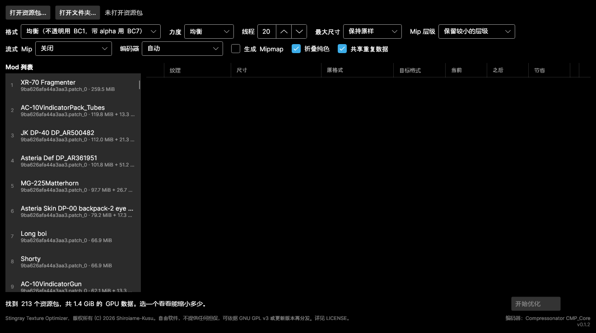
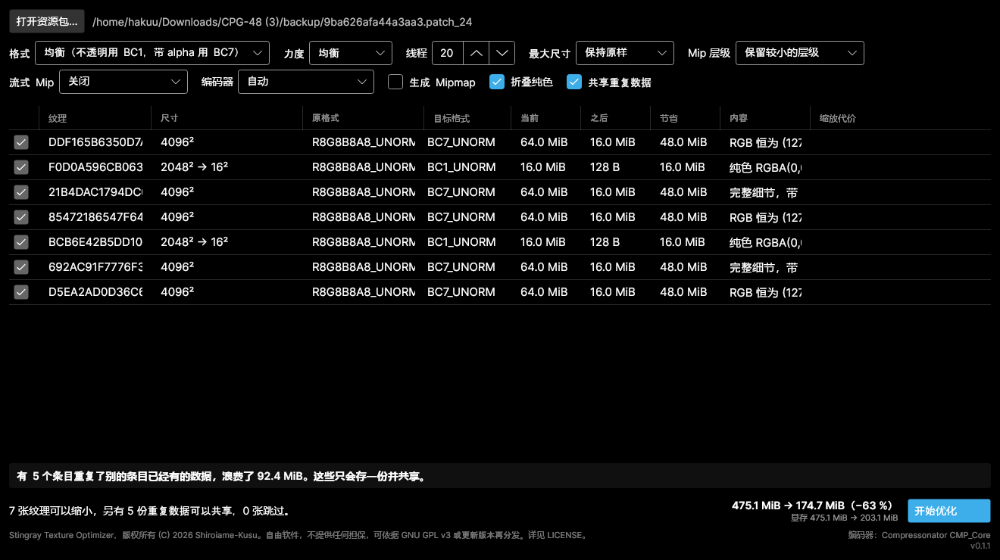
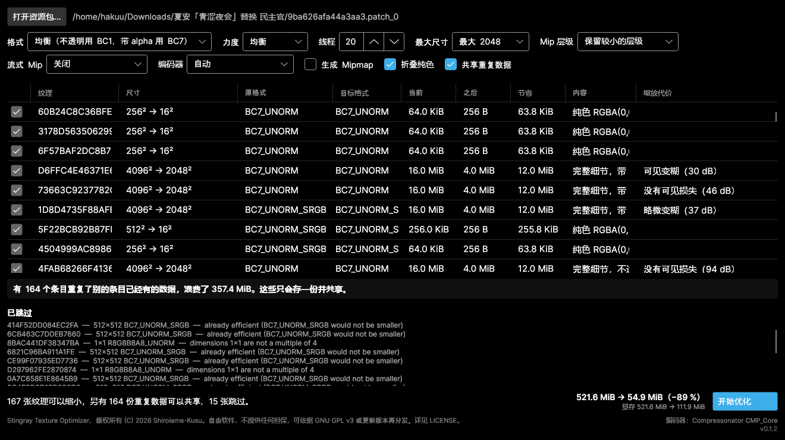
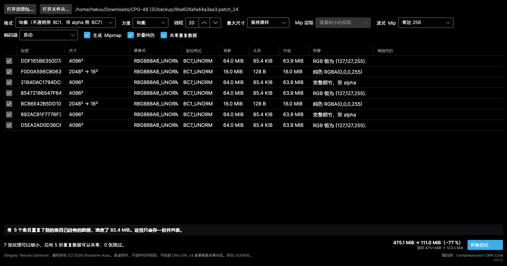

# Stingray Texture Optimizer

[English](README.md) | **简体中文**

> 我写这个工具，是因为有些 mod 的 `gpu_resources` 文件本身就已经 500 MB 以上，
> 加载进游戏之后还会再吃掉大约 0.5 GB 显存。
>
> 而这带来一个小问题：
>
> 我的 RTX 4060 只有 8 GB 显存。
>
> 一进游戏显存就爆了，然后立刻开始卡顿。
>
> 文件格式的解析是我自己设计的，核心功能也是我自己实现的。AI 不过是一个强大的工具。
> 我真正用它做的只有 GUI 部分，而且它生成的每一行代码我都亲自审查过才用。
>
> 我只是懒，不是傻。😎
>
> GLHF！

通过对 Stingray/Bitsquid 游戏资源包（bundle）内的纹理做块压缩来缩小它们。

**给所有装了 mod 的玩家**：如果你装的 mod 带着几百 MB 的纹理、把显卡的显存吃爆了，
这个工具就是给你的。你不需要自己做过 mod 才能用它，也不需要征得谁的同意：它处理你
下载来的 mod 和处理你自己写的 mod 完全一样，而且会留一份备份，随时可以还原。

**给 mod 作者**：如果你的 `.gpu_resources` 已经膨胀起来，与其让每个玩家自己想办法，
不如发布一个更小的版本。

支持 绝地潜兵 2（Helldivers 2）、Darktide 和 Vermintide 2 的资源包 —— 即
`<hash>.patch_N` 与 `.gpu_resources` 这一对文件。

## 效果

两个真实的 mod。“显存”是游戏必须放在显存里的量，如果你正好显存不够，这才是关键数字，
它和文件体积不是一回事，见[文件体积不等于显存](#文件体积不等于显存)。

| Mod | 磁盘 | 显存 |
| --- | --- | --- |
| 475 MiB，未压缩的 RGBA8 纹理 | 475 → **174.7 MiB** | 475 → **203.1 MiB** |
| 521 MiB，全部已是 BC7 | 521.6 → **114.9 MiB** | 521.6 → **303.9 MiB** |
| ……同一个 mod，允许 2048 上限 | 521.6 → **54.9 MiB** | 521.6 → **111.9 MiB** |

前两行是**无损**的：块压缩、把结果为单一颜色的整张贴图折叠掉、以及把逐字节相同的数据
只存一份。只有第三行才真的舍弃了东西，而且它会逐张纹理报告到底舍弃了多少。

两个资源包处理后都通过了校验：每个条目都能解析回它原本的内容，所有非纹理数据逐字节相同。

对于催生这个工具的那块 8 GB 显卡来说：第二个 mod **无损地**从 521.6 MiB 显存降到
303.9 MiB，如果允许 2048 上限则降到 **111.9 MiB**。这个上限会把 16 张纹理减半，其中
工具测出 8 张没有可见损失、7 张略微变糊、1 张有可见变糊 —— 并且会告诉你是哪一张，
于是你可以单独把它保持原尺寸。

### 这些数字为什么是这样

- **一张未做块压缩导出的 4096×4096 纹理正好是 64 MiB。** 压缩后是 4–8 倍的差距。
- **整张贴图常常是空的。** 有个 mod 里三张 4096×4096 的 BC7 纹理只装着一种颜色，
  每张 16 MiB；还有 120 份完全相同的纯黑 1024×1024 拷贝。
- **共享重复数据只缩小文件，不减少显存** —— 每个条目仍然是各自独立的 GPU 资源。
  如果你缺的是显存，你要的选项是 `--max-size`。

## 快速上手

第一次用？三步。

**1. 下载并解压。** 从 [Releases](../../releases) 拿到对应你系统的压缩包，解压到任意
位置。无需安装。

**2. 指向一个 mod。** 运行 `stingray-tex-gui`，点击 **Open bundle…**，选中资源包文件
—— 就是那个**没有扩展名**、或者以 `.patch_0`、`.patch_1` 之类结尾的文件。不要选
`.gpu_resources`，那个会被自动找到。

如果这个 mod 是你装的而不是你做的，这些文件就在你的 mod 管理器存放它们的地方 ——
一个 mod 一个文件夹，每个文件夹里放着上面那三个文件。

**或者直接点“打开文件夹…”，让它自己去找。** 指向你的 mod 管理器存放 mod 的那个文件夹，
它会把下面所有内容都搜一遍，每个资源包列一行、标出各自占多大，大的排在前面。点一个就能
看到它的处理方案。



所有 backup 文件夹都会被跳过，包括这个工具自己写出来的那些 —— 否则你已经优化过的每个
mod 都会出现两次，一次是现在的样子，一次是原来的样子。

**3. 看一眼，然后点 Optimize。** 表格里列出了每一张可以缩小的纹理以及它会变成什么样，
右下角是总计。确认没问题就按 **Optimize**。



怎么看：每一行是一张纹理，**Size → New** 是它现在占多少、之后会占多少，**Content**
是分析器在里面发现了什么。其中两张结果是纯色，于是从 2048² 折叠成 16×16 ——
16 MiB 变成 128 字节。按钮上方的横幅报告的是那些出现了不止一次、将会只存一份的数据。

右下角是总计：**475.1 MiB → 174.7 MiB**，以及单独列出的显存 —— 如果你显存紧张，
那才是要盯的数字。

在写入任何东西之前，你的原始文件会被复制到资源包旁边的 `backup/` 文件夹里，
之后结果还会被自动校验。

### 我该选什么

**默认设置是安全的 —— 你可以直接按 Optimize。** 默认开启的每一项要么完全无损，
要么肉眼无法分辨。

如果还想更进一步，唯一值得动的是 **Max size**。它会把过大的纹理减半，这也是这里唯一
真正丢弃细节的选项。它默认关闭。



把它调到 `2048 max`，**Resize cost** 一列就会填上每张纹理减半实际付出的代价 ——
这是在它自己的像素上测出来的。写着 *nothing visible lost* 的行是白赚的。写着
*visible softening* 或 *real detail lost* 的行才需要想一想 —— 取消左边的勾选，
就能让其中任何一张保持原尺寸。

这里它把这个 mod 从 521.6 MiB 降到 54.9 MiB，显存从 521.6 MiB 降到 111.9 MiB，
其中恰好有一张纹理被标记为可见变糊。

### 这安全吗

- 在写入任何东西之前，原文件已经备份。
- 结果会被自动校验；有问题工具会告诉你。
- 非纹理数据 —— 模型、骨骼、材质 —— 原样逐字节复制。

**在依赖它之前，请先把结果加载进游戏看一眼** —— 如果这是你要发布的 mod，那就更要在
分享之前这么做。在那之前请保留 `backup/` 文件夹。

如果你只是为了自己的机器去压缩别人的 mod：没有任何东西会离开你的硬盘 —— 工具是就地
重写文件的，`backup/` 文件夹随时可以把原件放回去。它也不会改变 mod 的安装或更新方式
—— 不过重新安装或更新那个 mod 会覆盖掉你压缩过的版本，所以把命令留着备用。

### 如果看起来不对

把 `backup/` 里的东西全部复制回去覆盖即可。就这么简单，其他任何东西都没有被改动。

## 为什么需要它

从图像编辑器导出的纹理进到资源包里时是未压缩的 RGBA8 且没有 mipmap：每像素 4 字节，
所以一张 4096×4096 的纹理正好是 64 MiB。块压缩能把它缩小 4–8 倍。

更大的收益来自“看内容”。mod 里经常有整个通道都是常量的纹理 —— 一个填了
(127,127,255) 的、根本没用上的法线贴图槽位，或者一张纯黑的遮罩。这个工具能识别出来
并把它们折叠掉。

一个真实的例子，475 MiB 的 mod：

```
texture          dimensions         format           size ->        new  content
DDF165B6350D7A78 4096x4096          BC7_UNORM    64.0 MiB ->   16.0 MiB  flat RGB(127,127,255), alpha has 6 values
F0D0A596CB063EB5 2048x2048->16x16   BC1_UNORM    16.0 MiB ->      128 B  solid RGBA(0,0,0,255)
21B4DAC1794DC6CC 4096x4096          BC7_UNORM    64.0 MiB ->   16.0 MiB  full detail with alpha
85472186547F6415 4096x4096          BC7_UNORM    64.0 MiB ->   16.0 MiB  flat RGB(127,127,255), alpha has 5 values
BCB6E42B5DD10AB6 2048x2048->16x16   BC1_UNORM    16.0 MiB ->      128 B  solid RGBA(0,0,0,255)
692AC91F7776F3C2 4096x4096          BC7_UNORM    64.0 MiB ->   16.0 MiB  full detail with alpha
D5EA2AD0D36C69DC 4096x4096          BC7_UNORM    64.0 MiB ->   16.0 MiB  flat RGB(127,127,255), alpha has 5 values

total 475.1 MiB -> 203.1 MiB (saves 272.0 MiB)
```

这七张里只有两张装着真正的美术内容。有两张是 2048² 的纯黑。

### 已经压缩过了？多半还是太大

哪怕一个资源包里的纹理全都规规矩矩是 BC7，它仍然可能大部分是浪费，因为 mod 常常把
同一份数据挂在很多个 id 下面。第二个真实例子 —— 182 张纹理，每一张都已经是 BC7，
没有任何可以重新压缩的东西：

```
duplicates: 164 entr(ies) repeat a payload another entry already has, wasting 357.4 MiB.
            These are stored once and shared.

total 521.6 MiB -> 164.3 MiB (saves 357.4 MiB)
```

其中 120 个条目是同一张 1024×1024 纹理的逐字节拷贝 —— 而那张纹理其实是纯黑的。
一旦分析器连压缩过的贴图也一并解码，同一个资源包会降到 **114.9 MiB，且没有任何损失**：
共享重复数据和折叠纯色贴图都是精确操作。

在此之上再允许缩放（`--max-size 2048`）会让它降到 **54.9 MiB**。

## 安装

### 预编译版本

从 [Releases](../../releases) 下载压缩包。不需要装别的东西 —— 连 .NET 运行时都不用。

| 平台 | 压缩包 |
| --- | --- |
| Linux x64 | `stingray-tex-<version>-linux-x64.tar.gz` |
| Windows x64 | `stingray-tex-<version>-win-x64.zip` |
| macOS Intel | `stingray-tex-<version>-osx-x64.tar.gz` |
| macOS Apple Silicon | `stingray-tex-<version>-osx-arm64.tar.gz` |

解压即用。请让这些文件待在一起 —— 可执行文件会加载它旁边的库。

```
stingray-tex           命令行，约 2.7 MB
stingray-tex-gui       图形界面，约 22 MB
libSkiaSharp.so        渲染
libHarfBuzzSharp.so    文字排版
stingray_cmp.so        快速编码器（Linux 和 Windows）
```

两者都用 **Native AOT** 编译，所以都不需要 .NET 运行时；在 Linux 上，二进制除了
`libc` 和 `libm` 之外不链接任何东西。命令行工具启动大约只要 1 毫秒。

Skia 和 HarfBuzz 之所以仍是独立的共享库，是因为 SkiaSharp 没有提供可供静态链接的库
文件。除此之外的一切都在可执行文件里面。

<details>
<summary>在 Avalonia 的 <code>DataGrid</code> 存在的前提下，GUI 是如何做到 AOT 安全的</summary>

XAML 里的每一个绑定都是编译期绑定，包括 `DataGrid` 单元格模板里的那些 —— 它们带着
内联的 `x:DataType`。反射绑定活不过裁剪，而编译器会逐个报告，所以这一点是在构建时
被检查的，而不是假设出来的。

剩下的就是 `Avalonia.Controls.DataGrid` 本身，它没有为裁剪做标注，会把警告汇总成
`IL2104`/`IL3053`。这两条在 `Stingray.Gui.csproj` 里被抑制，并记录了每条底层警告
分别覆盖了什么 —— 简单说：从不使用列自动生成；表格通过反射解析的行属性由
`TrimmerRoots.xml` 固定；没有任何一列需要类型转换的绑定。

由于“链接干净”并不能说明运行时反射没问题，CI 会用发布后的二进制在离屏渲染窗口，
如果拿不到图像就判定失败。

</details>

### 从源码构建

需要 [.NET 10 SDK](https://dotnet.microsoft.com/download)。

```sh
git clone https://github.com/Shiroiame-Kusu/StingrayTextureOptimizer.git
cd StingrayTextureOptimizer

# 可选但推荐：构建快速编码器（需要 cmake 和 C++ 编译器）。
# 只需运行一次；之后 dotnet build 会自动把它复制到程序输出目录。
./native/build.sh          # Windows 上是 native\build.ps1

dotnet build -c Release

# 可选：按发布方式做 Native AOT 构建（Linux 上需要 clang 和 zlib）
dotnet publish src/Stingray.Cli -c Release -r linux-x64 -o out/cli
dotnet publish src/Stingray.Gui -c Release -r linux-x64 -o out/gui
```

不做第一步工具照样能用，只是走较慢的托管编码器 —— GUI 的页脚和 `analyze` 的输出
都会说明当前用的是哪一个。

## 界面语言

图形界面有**英文和简体中文**两种，启动时会读取系统语言自动选择 —— 在 Linux 和 macOS 上
读 `LC_ALL`、`LC_MESSAGES`、`LANG` 或 `LANGUAGE`，在 Windows 上读用户的界面语言。
只要是中文就用中文，其他一律用英文。

想手动指定，设置 `STINGRAY_LANG`：

```sh
STINGRAY_LANG=zh stingray-tex-gui     # 强制中文
STINGRAY_LANG=en stingray-tex-gui     # 强制英文
```

繁体中文环境（`zh_TW`、`zh_HK`）同样会得到简体中文界面 —— 理由是简体总比英文更好读。

命令行不管系统语言如何都保持英文：它的输出是有文档的、会被 diff、也会被脚本解析，
如果 `analyze` 的输出随语言变化就全乱了。

程序本身不附带中日韩字体，用的是系统自带的 —— Windows、macOS 以及任何桌面版 Linux
都已经有了。

## 使用

### 图形界面

```sh
dotnet run --project src/Stingray.Gui -c Release
```

打开资源包，审阅方案，把你不认同的逐张纹理格式改掉，然后 Optimize。在写入任何东西
之前，原文件会被复制到资源包旁边的 `backup/` 文件夹，结果也会被自动校验。

### 命令行

```sh
# 看看会发生什么
stingray-tex analyze mymod.patch_0

# 原地重写（先备份到 ./backup，然后校验）
stingray-tex optimize mymod.patch_0

# 输出到别处而不是原地修改
stingray-tex optimize mymod.patch_0 --output ./out

# 检查一个资源包，也可以和它优化前的原件对比
stingray-tex verify mymod.patch_0 --original backup/mymod.patch_0
```

## 选项

同样的设置在 GUI 工具栏和命令行里都有。

### 格式 —— `--strategy`（GUI：*Format*）

每张纹理编码成哪种块压缩格式。同时影响体积和质量。

| 值 | GUI 标签 | 不透明 | 镂空 alpha | 渐变 alpha |
| --- | --- | --- | --- | --- |
| `balanced`（默认） | Balanced (BC1 opaque, BC7 with alpha) | BC1 | BC7 | BC7 |
| `quality` | Best quality (BC7 always) | BC7 | BC7 | BC7 |
| `smallest` | Smallest size (BC1 wherever it fits) | BC1 | **BC1** | BC7 |

BC1 只有 BC7 一半大，但它的颜色端点是 5:6:5，所以在渐变上会出现色带。BC7 几乎能精确
还原任何 8 位 RGBA。

“镂空 alpha”指 alpha 只有 0 或 255 —— 一张没有半透明的模板遮罩。BC1 正好存一位
alpha，所以这类纹理能以 BC7 一半的体积放进去。任何带渐变 alpha 的纹理在所有策略下
都需要 BC7。

### 力度 —— `--quality`（GUI：*Effort*）

`fast` | `balanced`（默认） | `best`。压缩器在定下结果之前尝试多少种编码。
**它绝不改变输出体积** —— 块压缩格式是定比率的 —— 只影响结果与源的接近程度和耗时。

在一张真实的 4096×4096 美术纹理上、12 线程实测：

| 格式 | 力度 | 耗时 | PSNR (RGB) |
| --- | --- | --- | --- |
| BC7 | Fast | 16.7 s | 50.62 dB |
| BC7 | Balanced | 22.9 s | 50.90 dB |
| BC7 | Best | 54.4 s | 51.24 dB |
| BC1 | Fast | 0.3 s | 37.98 dB |
| BC1 | Balanced | 1.1 s | 41.23 dB |
| BC1 | Best | 0.9 s | 41.29 dB |

这两种格式的表现完全不同：

- **BC7 几乎不吃力度。** 整个区间只差 0.6 dB，耗时却是 3.3 倍。`Best` 不值得，
  哪怕 `Fast` 也肉眼无法分辨。
- **BC1 在低端非常敏感。** `Fast` 相对 `Balanced` 要付出 3.3 dB，这是真实可见的差距 ——
  而 `Best` 在 `Balanced` 之上又几乎没有增益。

所以两种情况下 `balanced` 都是正确的默认值。只有在反复迭代且全是 BC7 时才用 `fast`；
有 BC1 参与时避开它。`best` 花大量时间却几乎买不到什么。

**力度是相对于你选的编码器而言的，不是一个绝对质量目标。** 同一个词含义并不同：

| | Fast | Balanced | Best |
| --- | --- | --- | --- |
| Compressonator | 51.6 dB | **54.6 dB** | 55.4 dB |
| BCnEncoder | 50.9 dB | 51.3 dB | 51.6 dB |

Compressonator 的 `balanced` 比 BCnEncoder 的 `best` 还高 3 dB。就算力度不变，
换编码器也会改变你的输出。

### 线程数 —— `--threads`

编码器工作线程数。默认是 **CPU 核心数 − 4**，刻意留出一些核心：用 BC7 编码把每个
核心都占满会让桌面完全没法用。

### 最大尺寸 —— `--max-size N`（GUI：*Max size*）

把任何大于 N 的纹理不断减半直到放得下。**默认关闭 —— 这是唯一真正有损的选项。**
每张受影响的纹理都会报告实测的细节代价，于是你可以把在意的那些取消勾选。见
[缩放会不会让画面变糊](#缩放会不会让画面变糊)。

**带 mip 链的纹理是通过丢弃层级来缩小的，而不是重新编码。** 每一个保留下来的层级都是
作者自己的数据、本就已经压缩过，所以不会重新采样，也不会引入世代损失 —— 这是一次
字节切片，整个资源包用时远不到一秒。DDS 头会被改写以描述剩下的内容。

这件事比听起来更重要。一个做得很好的 mod 可能已经全是 BC7、没有任何可重压的东西、
也没有重复数据，却依然吃掉大量显存，因为它的纹理带着完整的 mip 链而且全部常驻。

### Mip 层级 —— `--mips keep|single`（GUI：*Mip levels*）

| 值 | GUI 标签 | 保留什么 |
| --- | --- | --- |
| `keep`（默认） | Keep smaller levels | 只丢弃上限之上的层级，纹理仍然带 mipmap。 |
| `single` | Keep one level only | 只保留放得下的最大那一级，其余全部扔掉。 |

在一个真实的、已经全是 BC7 的 205.6 MiB mod 上实测 —— 在这之前它一点都省不下来：

| 上限 | `keep` | `single` |
| --- | --- | --- |
| 无 | 205.6 MiB | 178.6 MiB |
| 2048 | 165.6 MiB | 148.6 MiB |
| 1024 | **117.6 MiB** | **112.6 MiB** |
| 512 | 103.6 MiB | 102.1 MiB |

`single` 只小了大约 4%，因为顶层以下的所有层级加起来只占顶层的约三分之一。为此它
彻底放弃了 mipmap，于是缩小显示的表面又开始闪烁，纹理缓存效率也下降。**优先用
`keep`**；只有在你真的显存告急、而且那张纹理是像 UI 元素这种永远不会被缩小显示的
东西时，才考虑 `single`。

两种模式都会跳过流式纹理：它们的顶层住在 `.stream` 文件里，只切 `gpu_resources`
会让两者对不上。

### 生成 mipmap —— `--add-mips`（GUI：*Generate mipmaps*）—— 默认关闭

相当多的 mod 出厂时纹理**根本没有 mip 链** —— 直接从编辑器导出的图只有一级。这类
纹理在斜视或者拉远时会闪烁、爬行，因为 GPU 没有更小的层级可以采样。这个选项会把它
本该有的链补出来。

它也是让 `--stream` 对这些纹理生效的前提：流式加载只能搬运已经存在的层级，所以
单层纹理没有任何东西可以流式化。这就是为什么当你选择 *Stream mips* 层级时 GUI 会
替你把它勾上，而当你把那个改回 *Off* 时又会取消勾选 —— 单独开着它是成本，不是节省。

反过来也成立，但只在必须的时候：如果打开的资源包里没有任何纹理自带 mip 链，
*Stream mips* 会回到 *Off*，因为已经没有东西可供它作用了。如果确实有纹理自带链，
则常驻层级保持不变 —— 那些纹理原样就能流式化，所以“只对已经有链的纹理做流式、
不重新编码任何东西”依然是你可以提出的要求。

单独使用它会**多花**大约三分之一的显存，因为 0 层以下的链加起来正是这么多。
两个一起用才是重点：

| | 显存 |
| --- | --- |
| 未处理（7 张纹理，4096² RGBA8，无 mip） | 475.1 MiB |
| 压缩成 BC7 | 203.1 MiB |
| `--add-mips` | 229.7 MiB |
| `--add-mips --stream 256` | **123.5 MiB** |



这和第一张截图是同一个资源包，只改了一个下拉框。选中 *Keep 256 resident* 自动勾上了
*Generate mipmaps* —— 没有链的纹理无从流式 —— 并把 *Mip levels* 置灰，因为流式纹理
会保留它拥有的链。每张 64 MiB 的纹理常驻部分降到 **85.4 KiB**，完整的 4096² 链就在
一次流式加载之外，显存则从 475.1 MiB 降到 123.5 MiB。剩下的是网格数据，这个工具不碰。

把 **New** 一列和第一张截图比一比：单纯压缩把这些纹理降到每张 16 MiB，而这里降到了
85 KiB —— 不是靠扔掉什么，而是把它挪到了引擎在真正需要时才去取的地方。

这个选项会重新编码，所以不是无损的 —— 但 0 层与这张纹理在没有链的情况下会得到的
编码逐字节相同，所以近看时画面没有任何变化。它下面的层级是新生成的，用逐次盒式
滤波得到。

小于 4×4 的层级一律由可移植后端编码：CMP_Core 以完整的 4×4 块为单位工作、拒绝比这
更小的输入，而一条链仍然必须一路降到 1×1。

### 流式 mip —— `--stream N`（GUI：*Stream mips*）—— 实验性，默认关闭

这里其他所有选项都是用画质换显存，这一个是用**磁盘空间**换显存，**完全不损失画质**。

Stingray 本来就能把纹理的链留在 `.stream` 文件里、只在显存中长期保留一小截尾部，
在纹理真正出现在屏幕上时再按需加载清晰的层级。而 mod 工具链习惯性地把它碰过的每张
纹理都写成“未流式化”，这就把这个能力丢掉了 —— 于是一张 4096² 的 BC7 纹理不管你有没有
在看它，都以完整的 21.3 MiB 占着显存。`--stream 256` 会把整条链搬进 `.stream`，
只让 256² 及以下常驻。

在 Asteria 这个 mod 上，`--stream 256`：

| | 之前 | 之后 |
| --- | --- | --- |
| 显存 | 205.6 MiB | **99.4 MiB** |
| 磁盘上的 `.stream` | 1.5 MiB | 95.9 MiB |

转换了 19 张纹理。没有丢弃任何东西，也没有重新编码任何东西 —— 写出的每一个字节都是
原本就存在的字节的拷贝，测试会拿它和原件比对。没有被转换的是那些单层纹理，它们没有
链可搬。

**对于完全没有 mip 链的 mod，单独用这个选项什么也不会发生** —— 而相当多的 mod 正是
如此。先把链建出来，它们就能流式化了；当你选择一个层级时 GUI 会替你勾上
*Generate mipmaps*，命令行则会明说：

```
$ stingray-tex analyze mymod.patch_0 --stream 512
note: 7 texture(s) here carry no mip chain, so --stream cannot move them.
Pass --add-mips to build chains first, and they become streamable too.

$ stingray-tex analyze mymod.patch_0 --stream 512 --add-mips
gpu    143.1 MiB ->  124.7 MiB   (saves 18.3 MiB)
```

**它可以和 `--max-size` 组合使用**，而且通常你要的就是这个。上限会把它之上的层级
永久丢弃 —— 这是唯一损失画质的部分 —— 剩下的进入 `.stream`。所以
`--max-size 1024 --stream 256` 意味着 `.stream` 里放 1024 及以下，显存里放 256 及以下：

| | 增加到 `.stream` | 显存 |
| --- | --- | --- |
| `--stream 256` | 107.7 MiB | 99.4 MiB |
| `--max-size 1024 --stream 256` | **19.7 MiB** | 99.4 MiB |

一样的显存，五分之一的磁盘。常驻层级如果等于或高于上限就什么都流式不了，所以 GUI
不再提供这些选项，命令行也把它们当作空操作。

**这个选项开着时 Mip levels 不起作用。** 流式加载会保留在上限之后幸存的整条链 ——
这正是它的意义 —— 所以没有更多可丢的了，GUI 会禁用那个下拉框，而不是让它看起来
好像生效了。

#### N 到底是什么，以及该设成多少

N 是**永久留在显存里的最大 mip 层级**。在 `--stream 256` 下，256² 及以下的层级
长期住在 `.gpu_resources` 里，更大的只住在 `.stream` 里，等纹理出现在屏幕上时才加载。

所以常驻的那份是有保证的下限 —— 是在任何东西被流式加载进来之前就能立刻画出来的
内容。N 越低意味着永久占用的内存越少，但刚出现的东西第一眼会更糊。

听起来像是个真实的取舍。其实大体上不是：

| 常驻层级 | 显存 | 省下 |
| --- | --- | --- |
| 关闭 | 205.6 MiB | — |
| 2048 | 165.6 MiB | 40.0 MiB |
| 1024 | 117.6 MiB | 88.0 MiB |
| **512** | 103.6 MiB | **102.0 MiB** |
| 256 | 99.4 MiB | 106.2 MiB |
| 128 | 98.0 MiB | 107.6 MiB |
| 64 | 97.7 MiB | 107.9 MiB |

从 512 一路降到 64 只多买到 **5.9 MiB**，而此前已经省了 102 MiB —— 和本页其他地方
一样，还是那个等比级数。到 512 的时候基本上已经没什么可给的了。

**把它打开才是关键，具体数值几乎无所谓。** 用 **512**：距离最好情况只差 6 MiB，
同时始终常驻一份可用的图像，所以由模糊变清晰的过程最不显眼。更低的值是在用更糊的
第一帧去追最后那几个百分点。

**它为什么默认关闭。** 转换过程必须在 Stingray 前缀里写一个含义尚未确定的字段：
每张流式纹理在那里带着 1 或 2，而**纹理本身并不决定是哪一个**。从随游戏发布的数据里
读出 1,259 个纹理头之后可以确定，这并不是样本太少的问题 —— 在每一个头部字段上都完全
相同、连整张 mip 表都一样的纹理，两个值都出现过，所以决定它的东西不在纹理里。

本工具在前缀开头的 id 为零时写 2，否则写 1，这与随游戏发布的数据有 75% 的吻合度，
而任何基于该 id 的规则上限是 77%。它仍然是一个猜测。

**猜错了看起来无害。** 我们把两个 mod 里全部 53 张流式纹理的这个标志取反，两个方向
都覆盖到了，游戏里报告的差别是几乎没有 —— 没有加载失败，没有渲染错误。这是一次测试
而不是保证，而且细微的流式优先级差异本来就很难看出来，但它不是那种会让纹理坏掉的
字段。这个选项之所以仍然默认关闭，是因为它终究是在做一件没有问过引擎的事；请保留
备份并测试你自己的 mod。

### 折叠纯色 —— `--no-collapse` 关闭（GUI：*Collapse solid colours*）

每个像素都相同的纹理会被以 16×16 重写。视觉无损，因为常量纹理在任何分辨率下采样结果
都一样。**同时**节省文件体积和显存。只有当某个着色器用 `textureSize()` 或绝对的
`texelFetch` 坐标读取这张纹理时才需要关掉它。

### 共享重复数据 —— `--no-dedup` 关闭（GUI：*Share duplicates*）

逐字节相同的数据只存一份，由所有用到它的条目共同引用。无损，而且在一个已经压缩过的
资源包里通常是最大的一笔节省。**只缩小文件** —— 见
[文件体积不等于显存](#文件体积不等于显存)。

### 编码器 —— `--encoder`（GUI：*Encoder*）

由哪个压缩器干活。`auto`（默认） | `compressonator` | `managed`。

| 值 | GUI 标签 | 是什么 |
| --- | --- | --- |
| `auto`（默认） | Automatic | 可用时用快的，否则用可移植的 |
| `compressonator` | Fast (Compressonator) | 随附的约 500 KB 原生库，基于 AMD 的 CMP_Core 构建 |
| `managed` | Portable (BCnEncoder) | 纯托管实现，始终可用 |

快速编码器既更快*又*略好。在一张 4096×4096 的纹理上、12 线程实测：

| 编码器 | 力度 | 耗时 | PSNR |
| --- | --- | --- | --- |
| Compressonator | Fast | **1.6 s** | 51.6 dB |
| Compressonator | Balanced | 8.6 s | **54.6 dB** |
| BCnEncoder | Fast | 18.8 s | 50.9 dB |
| BCnEncoder | Best | 55.2 s | 51.6 dB |

Compressonator 在 *Fast* 下就追平了 BCnEncoder 的 *Best*，而且快 34 倍。

这个原生库只随 **Linux 和 Windows** 发布。macOS 版本只包含托管编码器，`auto` 会静默
回退到它 —— 在任何缺少该库的环境下都是如此。`--encoder compressonator` 则会明确报错，
好让你知道，而不是悄悄走了慢路径。想自己构建见
[`native/README.md`](native/README.md)。

### `--dry-run`

只分析和报告，不写入任何东西。

### `--version`

打印版本并退出。发布构建带着它的 git 标签；未打标签的 CI 构建报告
`0.0.0-<sha>`，所以任何一个二进制都能追溯到某次提交。GUI 在标题栏和右下角显示同样的
字符串。

## 去重

每一份 GPU 数据都会被哈希。当多个条目的内容逐字节相同时，这份数据只写一次，每个条目
都指向它 —— 这个格式为每个条目显式存储 `(offset, size)`，所以并不要求它们互不重叠。

这是无损的，而且在一个已经压缩过的资源包里通常是单项最大的节省。如果你想要严格的
一条目一数据布局，用 `--no-dedup` 关掉它。

## 文件体积不等于显存

工具报告两个数字，因为它们不是一回事：

```
disk   521.6 MiB ->   54.9 MiB   (saves 466.7 MiB)
gpu    521.6 MiB ->  111.9 MiB   (saves 409.7 MiB)
```

共享一份重复数据缩小的是**文件**，但引擎仍然为每个条目建立一个 GPU 资源，于是两个
条目都会被上传，显存没有变化。只有真正把贴图变小才对显存有帮助：

| 优化项 | 文件更小 | 显存更少 |
| --- | --- | --- |
| 块压缩 | 是 | 是 |
| 折叠纯色 | 是 | 是 |
| 缩放 | 是 | 是 |
| 共享重复数据 | 是 | **否** |

所以如果你追求的是下载体积，去重是大头。如果你追求的是显存，它毫无作用，你要的是
`--max-size` 或 `--stream`。

关于 GPU 数字的两点说明：它假设所有纹理同时常驻，这是最坏情况；并且它不包含引擎从
`.stream` 文件按需拉取的任何内容。

## Mip 层级与显存

mipmap 是为了过滤而存在的，不是为了加载。GPU 在采样时按*像素*选择层级，三线性过滤和
各向异性过滤就是这么回事 —— 所以整条链必须同时在内存里，因为硬件在任何时刻都可能
需要任何一级。这就是 mip 链会消耗显存而不是节省显存的原因。

**每一级是上一级的四分之一。** 因此这条链是一个收敛的等比级数：顶层以下的全部加起来
只有顶层的三分之一，整条链的开销是 **0 层的 4/3**。

由此可以得到两个结论，而且它们会以相反的方向让人意外。

**把链扔掉几乎没用。** 所有更小的层级加起来只是顶层的三分之一，所以丢掉它们只省 25%，
却让你失去 mipmap 带来的全部好处。这就是为什么 `--mips single` 在绝大多数情况下是笔
划不来的交易。

**把顶层减半会让一切变成四分之一。** 从前面丢掉一级，剩下整条链就只有原来的四分之一，
因为新的顶层是四分之一，而它之下的比例关系没有变。

对一张带完整 13 级链的 4096² BC7 纹理：

| 常驻在显存中的部分 | 怎么做到的 | 显存 | 占原始比例 |
| --- | --- | --- | --- |
| 整条链，从 4096 往下 | 未处理 | 21.33 MiB | 100% |
| 只有 4096 一级，无链 | `--mips single` | 16.00 MiB | 75% |
| 从 2048 往下的链 | `--max-size 2048` | 5.33 MiB | 25% |
| 从 1024 往下的链 | `--max-size 1024` | 1.33 MiB | 6.3% |
| 从 512 往下的链 | `--max-size 512` | 341.4 KiB | 1.6% |
| 从 256 往下的链 | `--max-size 256` | 85.4 KiB | 0.4% |

把最后四行当成一条规则来读：**每减半一次，开销就只剩四分之一。** 从 2048 上限降到
1024，按相对比例算，省下的几乎和第一次减半一样多。

### 流式加载如何改变这笔账

`--stream N` 常驻的层级和 `--max-size N` 完全相同 —— 都是从 N 往下的那一截 ——
所以它落在上面那张表的同一行：

| | 显存 | 你仍然能看到的最大层级 |
| --- | --- | --- |
| `--max-size 256` | 85.4 KiB | 256² —— 其余永久丢失 |
| `--stream 256` | 85.4 KiB | **4096²**，按需加载 |

显存完全一样，而其中一个把纹理保住了。差别体现在磁盘上（整条链搬进了 `.stream`
而不是被丢弃），以及延迟上：清晰的层级会在纹理进入视野之后不久才到，所以特写镜头
可能会短暂发糊。`--max-size` 不会有这种由模糊变清晰的过程，因为已经没有东西可加载了。

### 引擎实际上是怎么处理流式纹理的

绝地潜兵 2 把它的流式加载设置放在 `data/settings.ini` 里，所以这一段不是猜的：

- 层级是按**纹素密度**挑选的 —— 看纹理在屏幕上有多大，而不是离得有多远。
- 它从低层级开始往上爬（`initialize_at_max = false`），每帧限制在 16 MiB 和 32 次
  纹理更新之内。这个速率限制就是那种由模糊变清晰的过程。
- 流式内存是**有预算并会被回收的**：一个 1536 MB 的池，一段时间没被看到的纹理成为
  候选，层级先被降低然后卸载，而越接近预算上限引擎收缩得越狠。

这意味着这两个文件不只是放字节的两个不同位置：

| | 分配方式 |
| --- | --- |
| `.gpu_resources` | **始终分配**，无上限，占用 5376 MB 的纹理堆 |
| `.stream` | **上限 1536 MB**，引擎会通过回收把它压在这个数以内 |

所以流式加载是把内存从一份永久且无上限的分配，挪进一个峰值由引擎强制约束的池子里。
这才是它真正有用的原因：不只是数字更小，而是有了上界。

它也顺带明确了工具里 `gpu` 这个数字的含义。**它是始终分配的那部分** —— 在任何东西
被流式加载之前就已经永久花掉的量。流式内容最多再叠加一个池预算，而那部分由引擎自己
管理。

这就是 `--stream` 存在的全部理由。这里其他每个选项都是用画质换显存，这一个是用磁盘
空间换。

在一个真实的 205.6 MiB mod 上，其中 23 张纹理带着完整且全部常驻的链：

| | 显存 | 磁盘上的 `.stream` |
| --- | --- | --- |
| 未处理 | 205.6 MiB | 1.5 MiB |
| `--max-size 1024` | 117.6 MiB | 1.5 MiB |
| `--stream 256` | 99.4 MiB | 91.5 MiB |
| `--max-size 1024 --stream 256` | 99.4 MiB | 15.5 MiB |

最后一行通常才是你想要的。上限决定多少细节值得*保存*，常驻层级决定多少值得留在
*显存*里。显存和单用流式一样，磁盘只要六分之一。

（那 99.4 MiB 里剩下的部分是完全没有 mip 链的纹理，它们没有东西可流式化。流式加载
只能搬运已经存在的层级 —— 这正是 `--add-mips` 的用途。）

### 从来就没有链的纹理

单层纹理无法流式化，而且缩小显示时会闪烁。这两点都可以通过把它本该有的链建出来解决，
也就是 `--add-mips` 做的事。单独加一条链本身要多花三分之一的显存；配上常驻层级之后
几乎全都还回来了：

| | 每张 4096² 纹理的显存 |
| --- | --- |
| 无链（出厂状态） | 16.00 MiB |
| 加上链 | 21.33 MiB |
| 加上链，`--stream 256` | **85.4 KiB** |

在某个真实 mod 的 81 张无链纹理上，这是从 639.4 MiB 降到 8.1 MiB，而且它们在远处也
不再爬行了。

## 缩放会不会让画面变糊

缩放是这个工具唯一真正有损的操作，所以它**默认关闭**，而且每张受影响的纹理都是实测
而不是估计。

对每张纹理，分析器会把它减半再还原，然后报告 PSNR。这个数字说明有多少细节真的需要
完整分辨率：

| 实测值 | 含义 |
| --- | --- |
| ∞ | 纯色 —— 缩放不改变任何东西 |
| ≥ 45 dB | `nothing visible lost` —— 减半基本是白赚 |
| 36–45 dB | `slight softening`（略微变糊） |
| 30–36 dB | `visible softening`（可见变糊） |
| < 30 dB | `real detail lost`（真的丢了细节） |

**这个数字不随编码器变化，也不需要变化。** 它是在纹理自己的像素上、压缩之前测出来的。
块压缩带来的误差远小于减半，所以缩放这一项主导了总误差 —— 这一点在真实纹理上对照
完整的“缩放并重新编码”流程验证过：

| 纹理 | 报告值 | 缩放 + 编码 | 只编码 |
| --- | --- | --- | --- |
| 细节丰富的法线贴图 | 30.0 dB | 29.9 dB | 53.9 dB |
| 美术图 | 37.4 dB | 36.2 dB | 57.4 dB |
| 平滑图 | 50.4 dB | 49.8 dB | 78.3 dB |

所以你看到的数字与实际结果相差约 1 dB 以内。

来自某个真实资源包的八张不同的 4096² 纹理：三张是纯色，三张在 47–93 dB，一张 38 dB，
只有一张 30 dB —— 那是一张法线贴图，它细密的纹路确实明显变糊了。所以“我该不该把
4K 纹理减半？”这个问题对每张纹理都有不同的答案，这也是为什么方案里会显示这个数字并
让你逐张勾选。

已经压缩过的纹理只会被缩放，绝不会被重新编码成另一种格式：那样只会叠加世代损失而
换不到体积。sRGB 格式保持 sRGB，因为在引擎期望 sRGB 的地方写线性格式会让屏幕上每个
颜色都偏掉。

## 它是怎么判断的

| 内容 | 目标 | 无损 |
| --- | --- | --- |
| 每个像素都相同 | BC1（如果该颜色在 5:6:5 下不精确则用 BC7），折叠成 16×16 | 是 |
| alpha 全部不透明 | BC1 —— 在 `--strategy quality` 下则是 BC7 | 否 |
| alpha 带有细节 | BC7 | 否 |

常量纹理在任何分辨率下采样结果都一样，所以折叠它在视觉上是无损的。BC1 的端点是
5:6:5，所以像 (127,127,255) 这样的颜色*无法*原样通过；分析器会检查并回退到 BC7，
后者能精确还原任何 8 位 RGBA。

已经压缩过的纹理同样会被解码并分析 —— 一张 4096×4096 的 BC7 贴图其实只装着一种颜色，
就是这么被找出来的。带旧式 FourCC 头、BC6H 内容，或者尺寸不是 4 的倍数的纹理会被
报告并跳过。

## 安全性

重写一个资源包只会动两样东西：DDS 头字段，以及每个条目的 GPU 偏移和大小。CPU 侧数据
的长度永远不变，所以文件表里的每一个偏移都保持有效，非纹理资源也逐字节原样复制。

每次写入之后都会跟一次独立的校验：重新读回结果，检查对齐、重叠、越界、头与表是否一致，
以及 —— 在提供了原件时 —— 所有直通数据是否未被改动。

关于去重有一点需要说明：在条目之间共享数据是符合这个格式的，但检查过的原版资源包
里没有一个真的这么做，所以这不是一个已被*观察到*引擎会依赖的模式。它校验干净、每个
条目都能解析到相同的字节 —— 但无论你是准备发布这个 mod 还是只想自己玩，这都是最
值得在游戏里确认的部分。`--no-dedup` 可以完全避开它。

话虽如此：**这是在重写游戏文件。** 在你把结果加载进游戏之前，请保留备份。

## 目录结构

```
src/Stingray.Core   格式解析、分析、编码、校验
src/Stingray.Cli    stingray-tex
src/Stingray.Gui    Avalonia 桌面应用
tests/              xUnit，从零构建合成资源包
docs/               逆向得到的格式笔记
```

测试从不依赖真实游戏资源包 —— 那些是受版权保护的、不能提交 —— 所以
`SyntheticBundle` 会在内存中构造出合法的资源包。

## 格式

容器布局见 [`docs/bundle-format.md`](docs/bundle-format.md)，其中也包括哪些字段
仍未确定。

## 变更记录

见 [CHANGELOG.md](CHANGELOG.md)。

## 参与贡献

见 [CONTRIBUTING.md](CONTRIBUTING.md)。特别欢迎补充 type-id 表，前提是你能说明你是
怎么确认的。

## 许可

GPL-3.0-or-later。见 [LICENSE](LICENSE)。

> 本程序是自由软件：你可以依据自由软件基金会发布的 GNU 通用公共许可证的条款
> （第 3 版，或你选择的任何更新版本）对其进行再分发和／或修改。
>
> 本程序的分发是希望它能有用，但**不作任何担保**；甚至不含对**适销性**或
> **特定用途适用性**的默示担保。详见 GNU 通用公共许可证。

依赖项均采用宽松许可证，因此可以与 GPL 代码结合：
[BCnEncoder.Net](https://github.com/Nominom/BCnEncoder.NET)（MIT OR Unlicense）、
[Avalonia](https://avaloniaui.net/)（MIT）、
[CommunityToolkit.Mvvm](https://github.com/CommunityToolkit/dotnet)（MIT）和
[Tmds.DBus.Protocol](https://github.com/tmds/Tmds.DBus)（MIT）。它们各自的条款
继续适用于它们自身。

与 Autodesk、Arrowhead、Fatshark 或任何游戏发行商均无关联。
